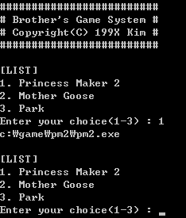

# [DOS Environment-related works]

- [Modify Autoexec.bat in Dosbox (2021.08.19)](/Dosbox#modify-autoexecbat-in-dosbox-20210819)
- [Nostalgic Game.bat (2021.08.19)](/Dosbox#nostalgic-gamebat-20210819)


## [Modify Autoexec.bat in Dosbox (2021.08.19)](/Dosbox#my-dos-environment-related-works)

simple commands to **mount C drive and move there** in **Dosbox**

\* modify [autoexec] part in `dosbox\dosbox.conf`, not directly `autoexec.bat`  
&nbsp;&nbsp;(can't approach to `Z:\` and also files there)

```bat
mount c c:\game
c:
```

\* The below two lines are automately inserted into `autoexec.bat` when Dosbox is initialized, so it's **not necessary to add** them in `dosbox.conf`.
```bat
SET BLASTER=A220 I7 D1 H5 T6
SET GLIDE=600
```


## [Nostalgic Game.bat (2021.08.19)](/Dosbox#my-dos-environment-related-works)

An old batch file recreated from my memory to help **my sister** excute games when she was young



```bat
@echo off
echo #########################
echo # Brother's Game System #
echo # Copyright(C) 199X Kim #
echo #########################
:LIST
echo.
echo [LIST]
echo 1. Princess Maker 2
echo 2. Mother Goose
echo 3. Park
set /p x=Enter your choice(1-3) : 
if "%x%"=="1" echo c:\game\pm2\pm2.exe
if "%x%"=="2" echo c:\game\mg\mg.exe
if "%x%"=="3" echo c:\park.exe
goto LIST
```
※ The games don't exist in my current desktop, so their paths are treated just as `echo` messages.