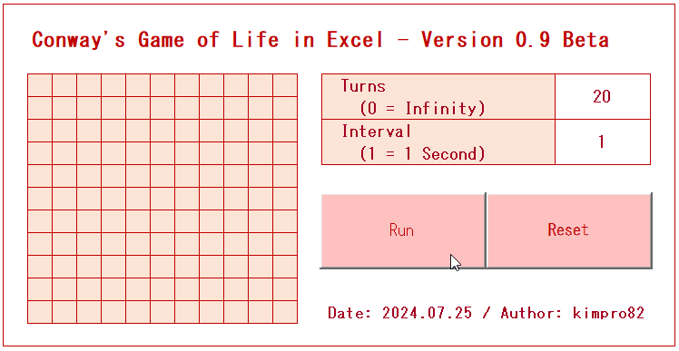

# [Game > Conway's Game Of Life](../README.md#roguelike-game)

Long live the cells


### \<References>

- [Wikipedia > Conway's Game of Life](https://en.wikipedia.org/wiki/Conway%27s_Game_of_Life)


### \<List>

- [Conway's Game of Life in Excel - Version 0.9 Beta (2024.07.25)](#conways-game-of-life-in-excel---version-09-beta-20240725)


## [Conway's Game of Life in Excel - Version 0.9 Beta (2024.07.25)](#list)

- Features

  

  - Configurable number of turns and speed
  - Fixed grid size (11 * 11)
  - Provides a fixed initial pattern in the shape of a cross
- Future Improvements
  - Allow users to customize the initial pattern or select from various predefined options
  - Display the remaining number of turns during execution
  - Add functionality to interrupt the loop and execute the game turn-by-turn
- Code : `ConwaysGameOfLife_0_9_Beta.bas`
  <details>
    <summary>Headers</summary>

    ```vba
    Option Explicit
    ```
    ```vba
    ' Structure definition
    Private Type LifeGrid
        startPoint As Range
        rowSize As Integer
        colSize As Integer
        cells() As Boolean
        turns As Integer
        interval As Integer
    End Type
    ```
    ```vba
    Private grid As LifeGrid
    ```
  </details>
  <details>
    <summary>InitializeGrid()</summary>

    ```vba
    ' Initializes the grid with default values
    Private Sub InitializeGrid()
        Set grid.startPoint = Range("C5")
        grid.rowSize = 11
        grid.colSize = 11
        grid.turns = Range("P5").Value
        grid.interval = Range("P7").Value

        ReDim grid.cells(1 To grid.rowSize, 1 To grid.colSize)

        Dim i As Integer, j As Integer

        For i = 1 To grid.rowSize
            For j = 1 To grid.colSize
                grid.startPoint.cells(i, j).Interior.Color = RGB(252, 228, 214) ' Initialize all cells with light orange color
                grid.cells(i, j) = False ' Initialize all cells as dead
            Next j
        Next i

        DrawGrid
    End Sub
    ```
  </details>
  <details>
    <summary>InitialPatternSample()</summary>

    ```vba
    ' Sets an initial sample pattern (cross shape in the center)
    Private Sub InitialPatternSample()
        ' Set cross shape in the center
        grid.cells(6, 5) = True
        grid.cells(6, 6) = True
        grid.cells(6, 7) = True
        grid.cells(5, 6) = True
        grid.cells(7, 6) = True

        DrawGrid
    End Sub
    ```
  </details>
  <details>
    <summary>CountNeighbors()</summary>

    ```vba
    ' Counts the number of live neighboring cells
    Private Function CountNeighbors(row As Integer, col As Integer) As Integer
        Dim count As Integer
        Dim i As Integer, j As Integer

        count = 0

        For i = row - 1 To row + 1
            For j = col - 1 To col + 1
                If (i > 0 And i <= grid.rowSize) And (j > 0 And j <= grid.colSize) And Not (i = row And j = col) Then
                    If grid.cells(i, j) Then
                        count = count + 1
                    End If
                End If
            Next j
        Next i

        CountNeighbors = count
    End Function
    ```
  </details>
  <details>
    <summary>UpdateGrid()</summary>

    ```vba
    ' Calculates the survival status of cells
    Private Sub UpdateGrid()
        Dim newCells() As Boolean
        ReDim newCells(1 To grid.rowSize, 1 To grid.colSize)

        Dim i As Integer, j As Integer, neighbors As Integer

        For i = 1 To grid.rowSize
            For j = 1 To grid.colSize
                neighbors = CountNeighbors(i, j)
                
                If grid.cells(i, j) Then
                    If neighbors < 2 Or neighbors > 3 Then
                        newCells(i, j) = False
                    Else
                        newCells(i, j) = True
                    End If
                Else
                    If neighbors = 3 Then
                        newCells(i, j) = True
                    Else
                        newCells(i, j) = False
                    End If
                End If
            Next j
        Next i

        For i = 1 To grid.rowSize
            For j = 1 To grid.colSize
                grid.cells(i, j) = newCells(i, j)
            Next j
        Next i

        DrawGrid
    End Sub
    ```
  </details>
  <details>
    <summary>DrawGrid()</summary>

    ```vba
    ' Displays the grid state on the screen
    Private Sub DrawGrid()
        Dim i As Integer, j As Integer

        For i = 1 To grid.rowSize
            For j = 1 To grid.colSize
                If grid.cells(i, j) Then
                    grid.startPoint.cells(i, j).Interior.Color = RGB(192, 0, 0) ' Live cells are dark red
                Else
                    grid.startPoint.cells(i, j).Interior.Color = RGB(252, 228, 214) ' Dead cells are light orange
                End If
            Next j
        Next i
    End Sub
    ```
  </details>
  <details>
    <summary>Main()</summary>

    ```vba
    ' Main procedure that runs the Game of Life
    Private Sub Main()
        Dim i As Integer

        If grid.turns = 0 Then
            Do
                Application.Wait Now + TimeValue("00:00:" & grid.interval)
                UpdateGrid
            Loop
        Else
            For i = 1 To grid.turns
                Application.Wait Now + TimeValue("00:00:" & grid.interval)
                UpdateGrid
            Next i
        End If
    End Sub
    ```
  </details>
  <details>
    <summary>btnRun_Click() & btnReset_Click()</summary>

    ```vba
    ' Click event procedure for the Run button
    Private Sub btnRun_Click()
        InitializeGrid
        InitialPatternSample
        Main
    End Sub
    ```
    ```vba
    ' Click event procedure for the Reset button
    Private Sub btnReset_Click()
        InitializeGrid
    End Sub
    ```
  </details>
