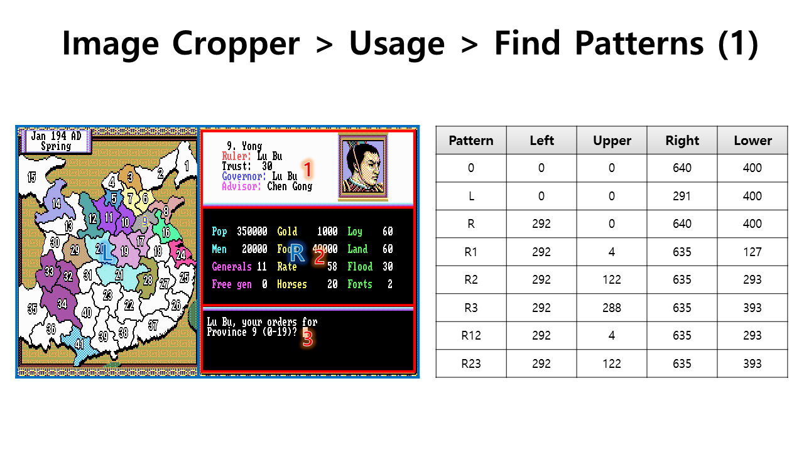
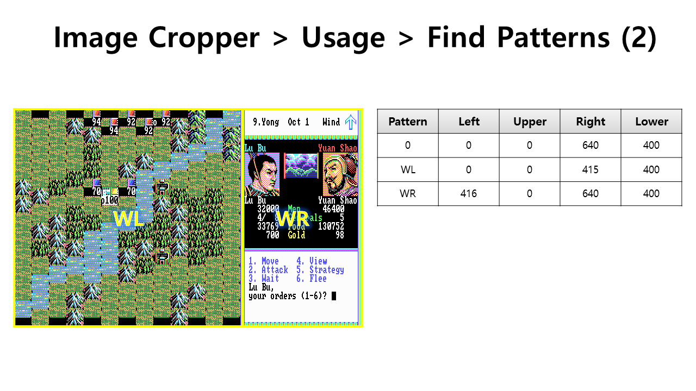
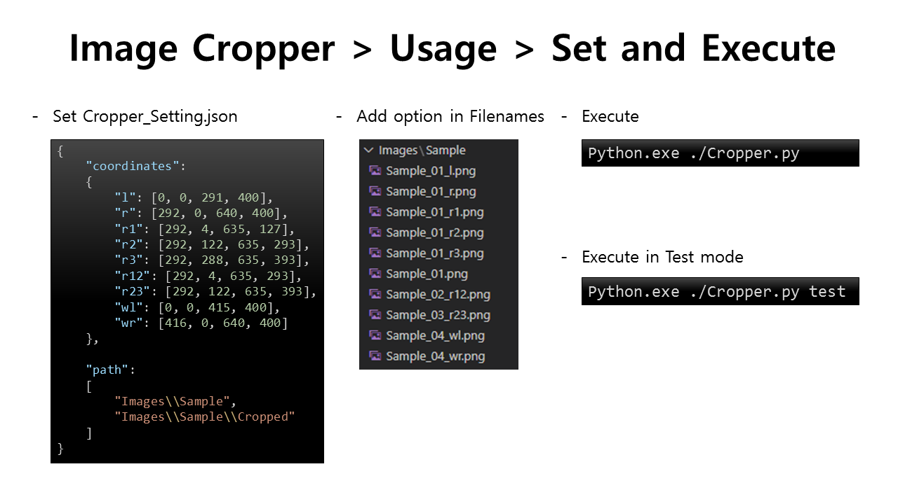
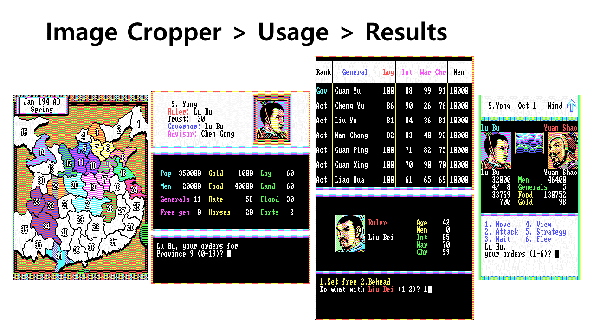
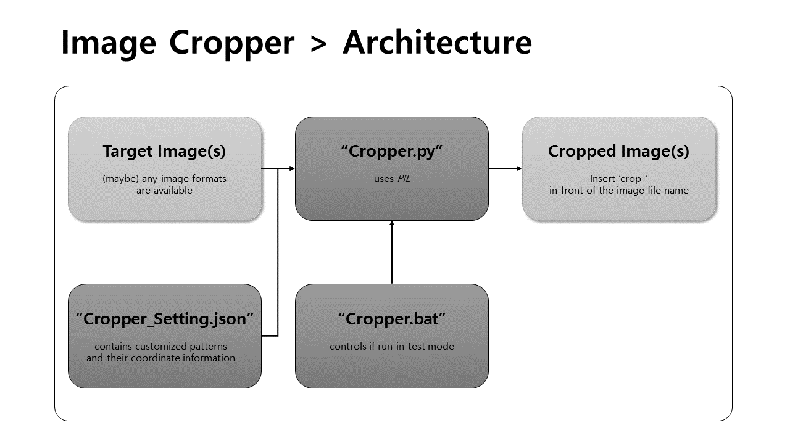
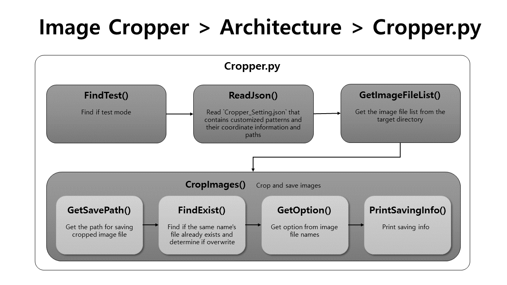

# [Game Capture Image Cropper](/README.md#game-capture-image-cropper)

Automate image cropping for repetitive and standardized tasks such as writing game reviews







## List

- [Image Cropper 2 (Comming)](#image-cropper-2-comming)
- [Image Cropper 1 (2022.03.28)](#image-cropper-1-20220328)


## [Image Cropper 2 (Comming)](#list)

- Improvements → [Game Capture Image Cropper 2 #78](https://github.com/kimpro82/MyGame/issues/78)

  1. Use *wrapper functions* instead of declaring `global test` in every function
  1. Replace `sys.argv` with `os.getenv()`
  1. Rename function and variable names to *snake_case* according to [*PEP8*](https://peps.python.org/pep-0008/) guidelines
  1. Change image naming convention from *prefix* to *postfix*
  1. Rename the variable name `path` to `paths` to better represent its contents
  1. Change `FindExist()` to return `True`/`False` instead of `y`/`n`
  1. Keep the nested data structure `params` as a whole instead of separating into `coordinates` and `paths`
  1. Use *(data)class* or *closure* to resolve issues related to global variables


## [Image Cropper 1 (2022.03.28)](#list)




- Code
  <details>
    <summary>Cropper_Setting.json (Sample)</summary>

  ```json
  {
      "coordinates": 
      {
          "l": [0, 0, 291, 400],
          "r": [292, 0, 640, 400],
          "r1": [292, 4, 635, 127],
          "r2": [292, 122, 635, 293],
          "r3": [292, 288, 635, 393],
          "r12": [292, 4, 635, 293],
          "r23": [292, 122, 635, 393],
          "wl": [0, 0, 415, 400],
          "wr": [416, 0, 640, 400]
      },

      "path":
      [
          "Images\\Sample",
          "Images\\Sample\\Cropped"
      ]
  }
  ```
  </details>
  <details>
    <summary>Cropper.py</summary>

  ```py
  # Libraries
  from PIL import Image                                       # PIL; Python Imaging Library
  import json                                                 # json.load(); call coordinates information for cropping from the external JSON file
  import os                                                   # os.path.*, os.getcwd(), os.makedirs(); deal with paths in various ways
  import sys                                                  # sys.argv; read "test" arguement from the terminal command or batchfile
  import pprint                                               # pprint.pprint(); print multi-line data like JSON with line replacement
  ```
  ```py
  # Global variables
  test = False
  ```
  ```py
  # Find if test mode
  def FindIfTest():

      global test                                             # must be declared in each udf
      args = sys.argv

      if len(args) >= 2 and args[1].lower() == "test":
          test = True
          print("<Test Mode>")

      return test

  ```
  ```py
  # Read `Cropper_Setting.json` that contains customized patterns and their coordinate information and paths
  def ReadJson():

      global test

      with open('./Cropper_Setting.json', 'r') as f:
          params = json.load(f)
      coordinates = params["coordinates"]
      path = params["path"]

      if test:
          print("\n- ReadJson()")
          pprint.pprint(coordinates)                          # ok
          print(path)                                         # ok

      return coordinates, path
  ```
  ```py
  # Get the image file list from the target directory
  def GetImageFileList(path):

      imageExtensions = ['.jpg', '.jpeg', '.png', '.bmp']     # can be added more
      imageFiles = []
      cwdImages = os.path.join(os.getcwd(), path[0])

      for file_name in os.listdir(cwdImages):
          ext = os.path.splitext(file_name)[-1].lower()
          if ext in imageExtensions:
              imageFiles.append(os.path.join(cwdImages, file_name))

      if test:
          print("\n- GetImageFileList()")
          print(cwdImages)                                    # ok
          pprint.pprint(imageFiles)                           # ok; including path

      return imageFiles
  ```
  ```py
  # Get the path for saving cropped image file in `CropImages()`
  def GetSavePath(imageFile, path):

      croppedImageFile = os.path.join(os.getcwd(), path[1], "Cropped_" + os.path.basename(imageFile))

      return croppedImageFile
  ```
  ```py
  # Find if the same name's file already exists and determine if overwrite in `CropImages()`
  def FindExist(croppedImageFile):

      overwrite = "y"

      if os.path.exists(croppedImageFile):
          while True:
              overwrite = input(f"{os.path.basename(croppedImageFile)} already exists. Do you want to overwrite it? (y/n) ").lower()
              if overwrite == "y":
                  break
              elif overwrite == "n":
                  break
              else:
                  print("Invalid input. Please enter y or n.")

      return overwrite
  ```
  ```py
  # Get option from image file names in `CropImages()`
  def GetOption(imageFile):

      global test
      option = ""
      imageFileName, ext = os.path.splitext(imageFile)        # `ext` won't be used
      underscoreIndex = imageFileName.rfind("_")              # find the string after the last "_"

      # Exception : Can have no option → underscoreIndex = -1
      if underscoreIndex > 0:
          option, ext = os.path.splitext(imageFileName[underscoreIndex+1:])
          # Exception 2 : Can be not valid option
          if option not in coordinates:
              option = "no valid option"

      if test:
          print(f"({option})".ljust(20), end="")

      return option
  ```
  ```py
  # Print saving info in `CropImages()`
  def PrintSavingInfo(i, cntImageFiles, overwrite, croppedImageFile):

      if overwrite == "y":
          print(f"({i + 1}/{cntImageFiles}) File saved. :", croppedImageFile)
      else:
          print(f"({i + 1}/{cntImageFiles}) File not saved. :", croppedImageFile)
  ```
  ```py
  # Crop and save images; Can be more divided but I am tired ……
  def CropImages(imageFiles, coordinates, path):

      global test

      if test:
          print("\n- CropImages()")

      # Make a new directory to save cropped image files if not exists (do not need `if` statement)
      os.makedirs(os.path.join(os.getcwd(), path[1]), exist_ok=True)

      cntImageFiles = len(imageFiles)
      cntDone = 0                                             # to count files that saved well
      for i in range(cntImageFiles):

          imageFile = imageFiles[i]
          croppedImageFile = GetSavePath(imageFile, path)
          overwrite = FindExist(croppedImageFile)

          # If no same name's file or allowed to be overwrited
          if overwrite == "y":
              option = GetOption(imageFile)
              image = Image.open(imageFile)
              cntDone += 1

              # Crop the image or save the original depending on the option
              if option in coordinates:
                  cropBox = coordinates[option]
                  imageCropped = image.crop(cropBox)
                  imageCropped.save(croppedImageFile)
              else:
                  image.save(croppedImageFile)                # the same with the original image when no option

          PrintSavingInfo(i, cntImageFiles, overwrite, croppedImageFile)

      return cntDone, cntImageFiles
  ```
  ```py
  # Run
  if __name__ == "__main__":

      FindIfTest()                                            # control global variable `test`
      coordinates, path = ReadJson()
      imageFiles = GetImageFileList(path)
      cntDone, cntImageFiles = CropImages(imageFiles, coordinates, path)
      print(f"({cntDone}/{cntImageFiles}) files have saved.")
  ```
  </details>
