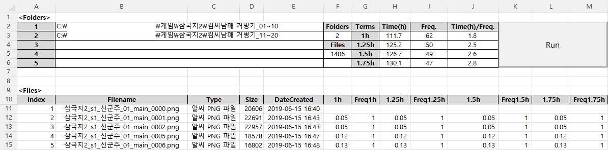
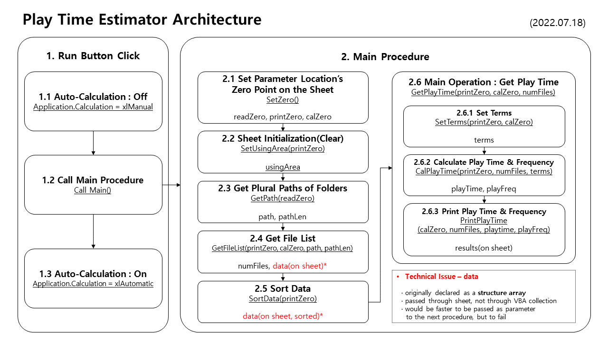

# [Play Time Estimator](../../README.md#play-time-estimator)

Estimate game play time and frequency based on capture images' information


### \<List>

- [Play Time Estimator 2 (2023.04.21)](#play-time-estimator-2-20230421)
- [Play Time Estimator (2022.07.18)](#play-time-estimator-20220718)


## [Play Time Estimator 2 (2023.04.21)](#list)

- Features
  - Estimate the execution time of the `.exe` file directly by *batchfile*(`.bat`), without relying on captured image saving times indirectly  
    - *Estimation* or *Measurement*? Philosophically, execution time is still a proxy of playtime, so I've determined to regard it as *estimation*.
  - Save `date` `start_time` and `end_time` into a `.ini` file (`elapsed_time` is failed)
  - In this code, the target `.exe` file has been replaced with `TestExecutionFile.bat`.
- Future improvements
  - Calculate cumulative playtime  
    (can adopt any other languages or even change the data format from `.ini`)
  - Record data for each save file that shares the same executable file
  - Exception handling: Address abnormal terminations

  <br>
  <details open>
    <summary>Output : Playtime.ini</summary>

  ```ini
  [TestExecutionFile.bat] 
  date=2023-04-22 
  start_time= 2:25:42.10 
  end_time= 2:25:43.22 
  elapsed_time= 

  [TestExecutionFile.bat] 
  date=2023-04-22 
  start_time= 2:25:45.91 
  end_time= 2:25:47.18 
  elapsed_time= 

  [TestExecutionFile.bat] 
  date=2023-04-22 
  start_time= 2:26:01.03 
  end_time= 2:26:04.22 
  elapsed_time= 
  ```
  </details>
  <details>
    <summary>Codes : TestExecutionFile.bat</summary>

  ```bat
  @echo off

  :: "almost" written by ChatGPT

  setlocal enableextensions enabledelayedexpansion

  set /a "n = %random% %% 3 + 1"
  set start_time=!time!
  timeout /t %n% > nul
  set end_time=!time!

  :: set /a "start_ms=((1!start_time:~0,2!-100)*3600 + (1!start_time:~3,2!-100)*60 + (1!start_time:~6,2!-100))*100 + (1!start_time:~9,2!-100)"
  :: set /a "end_ms=((1!end_time:~0,2!-100)*3600 + (1!end_time:~3,2!-100)*60 + (1!end_time:~6,2!-100))*100 + (1!end_time:~9,2!-100)"
  :: set /a "elapsed_time=(end_ms - start_ms) / 100"
  :: 균형이 맞지 않는 괄호

  echo [%0 starts running.]
  echo  Running time : %start_time% ~ %end_time%
  :: echo  Running time : %elapsed_time%?? (%start_time% ~ %end_time% )
  echo [%0 has ended.]

  endlocal
  ```
  </details>

  <details>
    <summary>Codes : PlaytimeEstimator2.bat</summary>

  ```bat
  @echo off

  :: "almost" written by ChatGPT

  :: Setting
  setlocal
  set program=TestExecutionFile.bat
  set log_file=Playtime.ini

  :: Run the program and measure its start and end time
  set start_time=%time%
  call %program%
  set end_time=%time%

  :: Calculate elapsed time.
  :: set /a elapsed_time=(1%end_time:~0,2%-100)*3600 + (1%end_time:~3,2%-100)*60 + (1%end_time:~6,2%-100) - ((1%start_time:~0,2%-100)*3600 + (1%start_time:~3,2%-100)*60 + (1%start_time:~6,2%-100))
  :: 균형이 맞지 않는 괄호

  :: Save execution date and time to log file.
  echo [%program%] >> %log_file%
  echo date=%date% >> %log_file%
  echo start_time=%start_time% >> %log_file%
  echo end_time=%end_time% >> %log_file%
  echo elapsed_time=%elapsed_time% >> %log_file%
  echo.>> %log_file%

  echo The recent playtime has been saved into "%log_file%".
  ```
  </details>


## [Play Time Estimator (2022.07.18)](#list)

- Assumption : If the interval between two images is short enough, that are captured steadily during play, I would play continuously during the period.
- Technique : deal VBA objects related with the file system
- How to Use : Input the plural folders (max : 5) then call the files and their informations and calculate the estimated play time and frequency 
- Limit
  - The estimations for the game play time and frequency have fluctuation based on the criteria period's length
  - couldn't find how to use a structure with *Call by Reference* method  
    → It caused data flow being inefficient

  <br>

  

  

  <details>
    <summary>Codes : PlayTimeEstimator.bas</summary>

  ##### Modul1
  ```vba
  Public Type FileInfo

      fileName        As String
      fileType        As String
      fileSize        As Integer
      fileDateCreated As Date

  End Type
  ```

  ##### Sheet1
  ```vba
  Option Explicit
  ```
  ```vba
  Private Sub btnRun_Click()

      Application.Calculation = xlManual
          Call Main
      Application.Calculation = xlAutomatic

  End Sub
  ```
  ```vba
  Sub Main()

      ' Set zero points
      Dim readZero    As Range
      Dim printZero   As Range
      Dim calZero     As Range
      Call SetZero(readZero, printZero, calZero)

      ' Set area to print
      Dim usingArea   As Range
      Call SetUsingArea(printZero, usingArea)

      ' Get path
      Dim path(5)     As String
      Dim pathLen     As Integer
      Call GetPath(readZero, path, pathLen)

      ' Get oFile collection's informations to 'data' array
      Dim numFiles    As Integer
      Call GetFileList(printZero, calZero, path, pathLen, numFiles)

  '    ' Failure : can't use structure array as a ByRef parameter (actually it seems to perform not so significantly improved)
  '    ' Get oFile collection's informations to 'data' array
  '    Dim data(100)      As FileInfo
  '    Dim numFiles       As Integer
  '    Call GetFileList(printZero, path, pathLen, data, numFiles)
  '    ' cause an error : Only public user defined types defined in public object modules can be used as parameters or return types for public procedures of class modules or as fields of public user defined types
  '    ' https://docs.microsoft.com/ko-kr/office/vba/language/reference/user-interface-help/only-public-user-defined-types-defined-in-public-object-modules-can-be-used-as-p
  '
  '    ' Print data
  '    Call PrintFileList(printZero, data, numFiles)

      ' Sort data on the sheet by DateCreated
      Call SortData(printZero)

      ' Get play time
      Call GetPlayTime(printZero, calZero, numFiles)

  End Sub
  ```
  ```vba
  Sub SetZero(ByRef readZero As Range, printZero As Range, calZero As Range)

      Set readZero = Range("B2")
      Set printZero = Range("A11")
      Set calZero = Range("F3")

  End Sub
  ```
  ```vba
  Sub SetUsingArea(ByRef printZero As Range, ByRef usingArea As Range)

      Set usingArea = Range(printZero, printZero.Offset(10000, 12))

      usingArea.ClearContents
      ' usingArea.VerticalAlignment = xlCenter                                            ' why doesn't it work? aligned manually on the sheet

  End Sub
  ```
  ```vba
  Sub GetPath(ByRef readZero As Range, ByRef path As Variant, ByRef pathLen As Integer)   ' array should be passed as Variant

      pathLen = Range(readZero, readZero.End(xlDown)).Count
          Debug.Print "pathLen : " & pathLen

      If pathLen > 0 And readZero <> "" Then
          Dim i As Integer
          For i = 1 To pathLen
              path(i) = readZero.Offset(i - 1, 0).Value
              Debug.Print path(i)
          Next i
      Else
          path(1) = ThisWorkbook.path
          Debug.Print path(1)
      End If

  End Sub
  ```
  ```vba
  Sub GetFileList(ByRef printZero As Range, ByRef calZero As Range, ByRef path As Variant, ByRef pathLen As Integer, ByRef numFiles As Integer)
  'Sub GetFileList(ByRef printZero As Range, ByRef path As Variant, ByRef pathLen As Integer, ByRef data As Variant, ByRef numFiles As Integer)

      Dim oFSO        As Object
      Dim oFolder(5)  As Object
      Dim oFile       As Object

      Set oFSO = CreateObject("Scripting.FileSystemObject")

      ' Get the length of the struct array
      Dim i           As Integer
      For i = 1 To pathLen
          Set oFolder(i) = oFSO.GetFolder(path(i))
          ' Debug.Print oFolder.Name
          numFiles = numFiles + oFolder(i).Files.Count
          ' Debug.Print "numFiles : " & numFiles                                          ' ok
      Next i

      ' Save data into the struct array
      Dim data()      As FileInfo
      ReDim data(numFiles)
      For i = 1 To pathLen
          Set oFolder(i) = oFSO.GetFolder(path(i))
          Dim j As Integer
          For Each oFile In oFolder(i).Files                                              ' .Files property returns a Files collection consisting of all File objects
              If oFile.Type = "알씨 PNG 파일" Then                                        ' how can it be just "PNG"?
                  data(j).fileName = oFile.Name
                  data(j).fileType = oFile.Type
                  data(j).fileSize = oFile.Size
                  data(j).fileDateCreated = oFile.DateCreated
                  j = j + 1
              Else
                  numFiles = numFiles - 1
              End If
          Next oFile
      Next i
      Debug.Print "numFiles : " & numFiles

      ' Print pathLen and numFiles
      calZero.Offset(0, 0).Value = pathLen
      calZero.Offset(2, 0).Value = numFiles

      ' Print data on the sheet
      For i = 0 To numFiles - 1
          printZero.Offset(i, 0) = i + 1
          printZero.Offset(i, 1) = data(i).fileName
          printZero.Offset(i, 2) = data(i).fileType
          printZero.Offset(i, 3) = data(i).fileSize
          printZero.Offset(i, 4) = data(i).fileDateCreated
      Next i

  End Sub
  ```
  ```vba
  'Sub PrintFileList(ByRef printZero As Range, ByRef data As Variant, ByRef numFiles As Integer)
  '
  '    ' Print data on the sheet
  '    For i = 0 To numFiles - 1
  '        printZero.Offset(i, 0) = data(i).fileName
  '        printZero.Offset(i, 1) = data(i).fileType
  '        printZero.Offset(i, 2) = data(i).fileSize
  '        printZero.Offset(i, 3) = data(i).fileDateCreated
  '    Next i
  '
  'End Sub
  ```
  ```vba
  Sub SortData(ByRef printZero As Range)

      ' Debug.Print printZero.End(xlDown).Address                                         ' ok : $A$1416
      Range(printZero, printZero.End(xlDown).Offset(0, 4)).Sort _
          Key1:=printZero.Offset(0, 4), _
          Order1:=xlAscending

  End Sub
  ```
  ```vba
  Sub GetPlayTime(ByRef printZero As Range, ByRef calZero As Range, ByRef numFiles As Integer)

      Dim playTime(4) As Double
      Dim playFreq(4) As Integer

      ' Set playFreq() start from 1
      Dim i           As Integer
      For i = 1 To 4
          playFreq(i) = 1
      Next i

      ' Set terms for calculating playTime
      Dim terms(4)    As Single                                                           ' hour
      Call SetTerms(printZero, calZero, terms)

      ' Calculate
      Call CalPlayTime(printZero, numFiles, terms, playTime, playFreq)

      ' Print calculation results
      Call PrintPlayTime(calZero, numFiles, playTime, playFreq)

  End Sub
  ```
  ```vba
  Sub SetTerms(ByRef printZero As Range, ByRef calZero As Range, ByRef terms As Variant)

      ' Set terms for calculating playTime
      terms(1) = 1
      terms(2) = 1.25
      terms(3) = 1.5
      terms(4) = 1.75

      Dim i As Integer
      For i = 1 To 4
          calZero.Offset(i - 1, 1).Value = terms(i) & "h"
          printZero.Offset(-1, 5 + 2 * (i - 1)).Value = terms(i) & "h"
          printZero.Offset(-1, 6 + 2 * (i - 1)).Value = "Freq" & terms(i) & "h"
      Next i

  End Sub
  ```
  ```vba
  Sub CalPlayTime(ByRef printZero As Range, ByRef numFiles As Integer, ByRef terms As Variant, ByRef playTime As Variant, ByRef playFreq As Variant)

      Dim diff        As Double
      Dim i           As Integer
      Dim j           As Integer
      Dim continuous  As Integer

      ' Calculate playTime() and playFreq()
      For i = 1 To numFiles - 1
          diff = (printZero.Offset(i, 4).Value - printZero.Offset(i - 1, 4).Value) * 24   ' hour

          continuous = 99
          For j = 1 To 4
              If diff < terms(j) Then
                  continuous = j
                  Exit For                                                                ' break
              End If
          Next j

          For j = 1 To 4
              If continuous <= j Then
                  playTime(j) = playTime(j) + diff
              Else
                  playFreq(j) = playFreq(j) + 1
              End If
          Next j

          For j = 1 To 4
              printZero.Offset(i, 5 + 2 * (j - 1)).Value = playTime(j)
              printZero.Offset(i, 6 + 2 * (j - 1)).Value = playFreq(j)
          Next j
      Next i

  End Sub
  ```
  ```vba
  Sub PrintPlayTime(ByRef calZero As Range, numFiles As Integer, playTime As Variant, playFreq As Variant)

      ' Print calculation results
      Dim i As Integer
      For i = 1 To 4
          calZero.Offset(i - 1, 2).Value = playTime(i)
          calZero.Offset(i - 1, 3).Value = playFreq(i)
          calZero.Offset(i - 1, 4).Value = playTime(i) / playFreq(i)
      Next i

  End Sub
  ```
  </details>