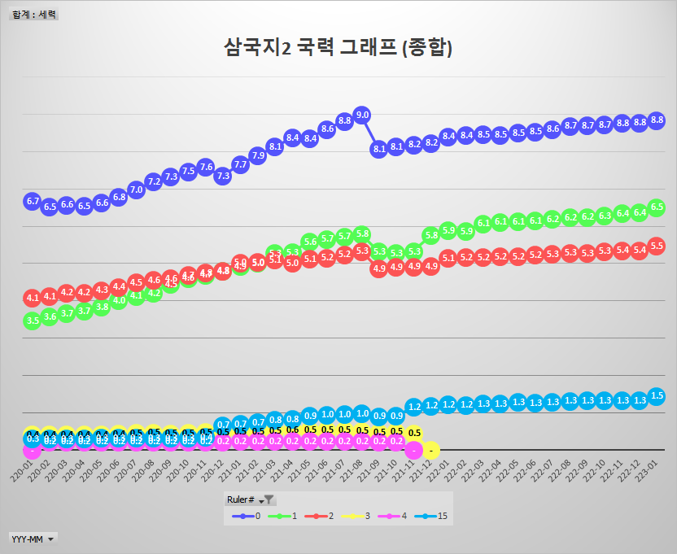
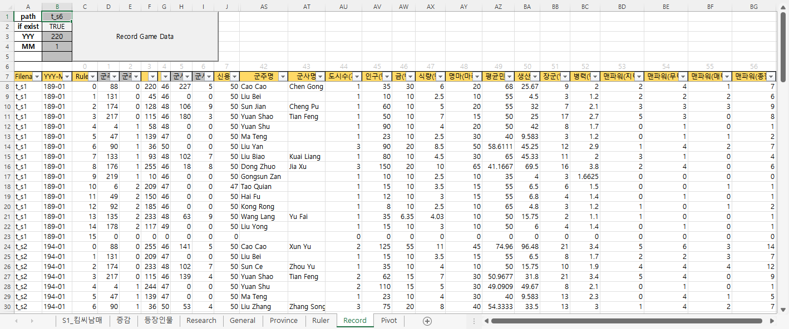
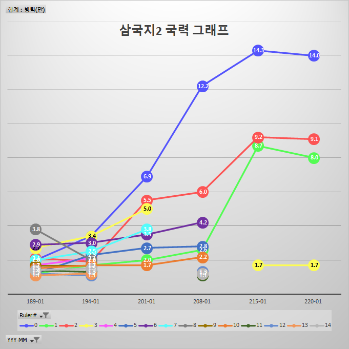
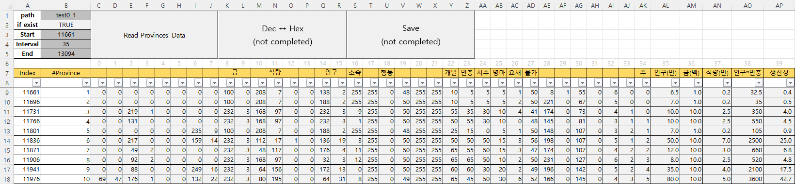
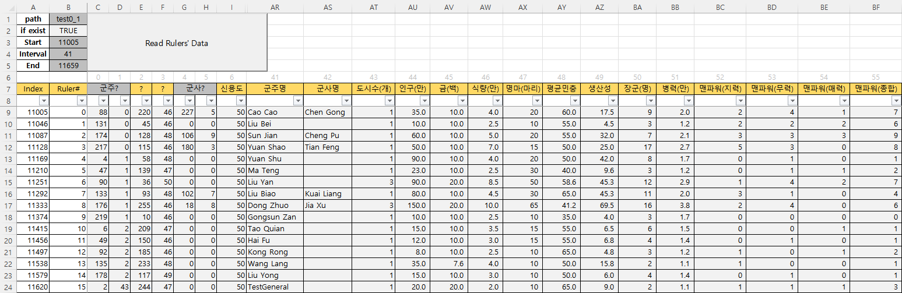
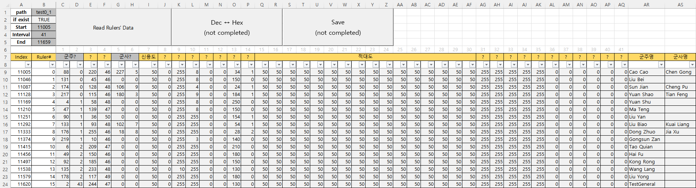
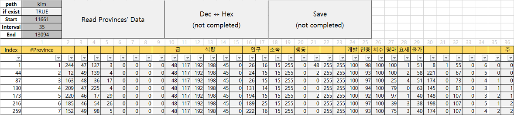
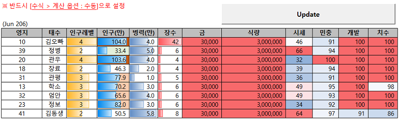
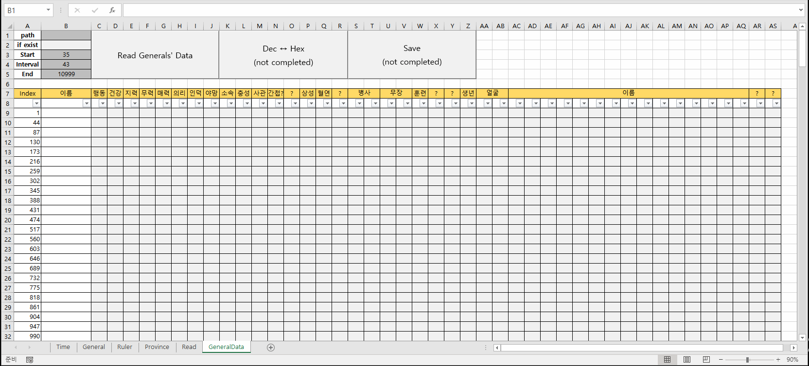

# [RTK2 ERP / VBA](/README.md#rtk2-erp)

a great journey to construct RTK2(Romance of The Three Kingdoms II, KOEI, 1989) ERP


## List

- [Read the Save Data in a Linked List Structure (2025.07.26)](#read-the-save-data-in-a-linked-list-structure-20250726)
- [Ruler 3 & General 2 (2022.07.10)](#ruler-3--general-2-20220710)
- [Record (2022.06.19)](#record-20220619)
- [Ruler 2 & Province 2 (2022.05.07)](#ruler-2--province-2-20220507)
- [Ruler (2022.05.05)](#ruler-20220505)
- [Province & Arbitrage System (2021.08.25)](#province--arbitrage-system-20210825)
- [General (2021.08.24)](#general-20210824)


## [Read the Save Data in a Linked List Structure (2025.07.26)](#list)
- Migration from [RTK2 : Read the Save Data in a Linked List Structure (Python)](https://github.com/kimpro82/MyGame/pull/93)
  - An upgraded version of the previous `General`, `Province`, and `Ruler`
    - Sorts province and general data using the linked list structure from the binary save file
    - Replaces the old inefficient operation with array-based operation
  - Future Improvements
    - Add column names and identify remaining unknown binary values
    - Update `Play`(new), `Record`
- Results : `RTK2_SaveData_Extractor.bas`
    <details>
        <summary>General</summary>

    ```csv
    1	61	Cao Cao	0	0	95	91	95	60	65	99	1	0	1	255	0	1	1	0	10000	1000	80	0	0	155	103	17	Cao Cao	Cao Cao
    61	77	Sima Yi	0	0	98	67	93	88	73	98	1	95	1	255	0	2	0	0	1000	100	80	0	0	179	79	17	Cao Cao	Cao Cao
    77	87	Cao Pi	0	0	76	70	80	82	84	83	1	100	1	255	0	1	1	0	1000	100	80	0	0	187	104	17	Cao Cao	Cao Cao
    87	88	Cao Zhang	0	0	60	92	72	86	78	76	1	100	1	255	0	1	1	0	1000	100	80	0	0	190	98	17	Cao Cao	Cao Cao
    88	89	Cao Zhi	0	0	80	15	80	82	82	18	1	100	1	255	0	1	1	0	1000	100	80	0	0	192	99	17	Cao Cao	Cao Cao
    ```
    </details>
    <details>
        <summary>Province</summary>

    ```csv
    17	18	1	Cao Cao	0	0	0	0	3000	70000	0	200000	1	255	0	51	TRUE	73	74	67	10	4	55	9	Cao Cao	20000	11	0
    18	13	19	Zhang Liao	0	0	0	0	2500	45000	0	250000	1	255	0	48	FALSE	72	66	66	10	3	57	9	Cao Cao	12000	8	0
    13	8	15	Zhang Lu	0	0	0	0	2500	30000	0	240000	1	255	0	48	FALSE	70	80	75	10	3	52	6	Cao Cao	5000	1	0
    8	29	10	Xiahou Dun	0	0	18	8	2500	35000	0	80000	1	255	0	48	FALSE	65	67	72	10	2	55	3	Cao Cao	6000	2	0
    29	11	28	Xiahou Yuan	0	0	0	0	2500	45000	0	300000	1	255	0	50	TRUE	65	81	67	5	3	48	12	Cao Cao	10000	6	0
    ```
    </details>
    <details>
        <summary>Ruler</summary>

    ```csv
    1	Cao Cao	17	Sima Yi	50	0	255	1	0	0	42	8	50	50	50	50	50	50	50	50	50	50	50	50	50	50	50	50	255	255	255	255	255	0	0	0	0	0	0	18	45500	680000	4560000	143000	66	0
    2	Liu Bei	33	Zhuge Liang	50	0	255	0	0	0	130	5	50	50	50	50	50	50	50	50	50	50	50	50	50	50	50	50	255	255	255	255	255	0	0	0	0	0	0	7	4000	210000	2830000	87000	54	0
    3	Sun Quan	24	Lu Su	50	0	255	1	0	0	30	5	50	50	50	50	50	50	50	50	50	50	50	50	50	50	50	50	255	255	255	255	255	0	0	0	0	0	0	12	6500	200000	2790000	92000	39	0
    4	Meng Huo	36		50	0	255	1	0	0	250	0	50	50	50	50	50	50	50	50	50	50	50	50	50	50	50	50	255	255	255	255	255	0	0	0	0	0	0	1	1000	35000	85000	17000	8	0
    5		-333		0	0	255	255	0	0	0	0	50	50	50	50	50	50	50	50	50	50	50	50	50	50	50	50	255	255	255	255	255	0	0	0	0	0	0	0	0	0	0	0	0	0
    ```
    </details>


## [Ruler 3 & General 2 (2022.07.10)](#list)

  - New indices :
    - `Total Measurement` : Province 0.125 (+ Productivuty 0.125) + Gold & Food 0.25 + Generals 0.125 (Manpower +0.125) + Arms 0.125 (+ Quality 0.125)
    - `Soldiers' Quality` : (Men / 10000) * (Weapon + Trainning * 100) / 20000
  - Separate `RefreshPivotTables()` from `btnRecordGameData_Click()`
  - Small update on `RTK2_Record_2.bas` : Modify the range to bring data from the `Ruler` sheet
  - Bug Fix :
    - Make not to count unavailable general (ex. dead but still listed)
    - Convert August not to `9`, but to `09` in `YYY-MM`

    

    <details>
        <summary>RTK2_Ruler_3.bas : Mainly changed part</summary>

    ```vba
    Sub ReadRulerData()

        ……
            ……
                ……

                'print the number of the generals
                output.Offset(row, 50).Value = Application.WorksheetFunction.IfError( _
                    Application.WorksheetFunction.CountIfs( _
                        Sheet5.Range("K:K"), _
                        row, _
                        Sheet5.Range("Z:Z"), _
                        ">0" _
                    ), _
                    "" _
                )

                ……

                'print total measurement (new)
                'weight : Province 0.125 (+ Productivuty 0.125) / Gold & Food 0.25 / Generals 0.125 (Manpower +0.125) / Arms 0.125 (+ Quality 0.125)
                output.Offset(row, 57).Value = Application.WorksheetFunction.IfError( _
                    (output.Offset(row, 43).Value + output.Offset(row, 49).Value / 50) * 0.125 _
                    + (output.Offset(row, 45).Value + output.Offset(row, 46).Value) / 2 / 300 * 0.25 _
                    + (output.Offset(row, 50).Value + output.Offset(row, 56).Value * 2) / (255 / 41) * 0.125 _
                    + (output.Offset(row, 51).Value + output.Offset(row, 52).Value) / (255 / 41) * 0.125 _
                    , _
                    "" _
                )

                ……
            ……
        ……

    End Sub
    ```
    </details>

    <details>
        <summary>RTK2_General_2.bas : Mainly changed part</summary>

    ```vba
    Sub ReadGeneralData()

        ……
            ……
                ……

                'print the soldiers' quality : (men / 10000) * (weapon + trainning * 100) / 20000
                output.Offset(row, 43).Value = _
                    (output.Offset(row, 16).Value + output.Offset(row, 17).Value * 256) / 10000 _
                    * (output.Offset(row, 18).Value + output.Offset(row, 19).Value * 256 _
                        + output.Offset(row, 20).Value * 100) _
                    / 20000

                ……
            ……
        ……

    End Sub
    ```
    </details>

    <details>
        <summary>RTK2_Record_2.bas : Mainly changed part</summary>

    ```vba
    Sub RecordGameData()

        ……

        'Call the file's date (YYY-MM)
        ……

        mm = mm + 1                                             'add 1 because Jan : 0, Feb : 1
        If mm < 10 Then
            Range("B4") = 0 & mm
            ym = CStr(yyy) & "-0" & CStr(mm)
        ……

        ……

        'Get the New Data
        Range("C8:BI23").Offset(row, 0) = Sheet7.Range("B9:BH24").Value

        ……

    End Sub
    ```
    ```vba
    Private Sub btnRecordGameData_Click()

        ……

        'Skip excel formula calculation temporarily
        ……
            Call Sheet9.RefreshPivotTables
        ……

    End Sub
    ```
    </details>

    <details>
        <summary>RTK2_Pivot.bas</summary>

    ```vba
    Option Explicit


    ' Refresh all the Pivot Table and Chart
    Sub RefreshPivotTables()

            PivotTables("PivotTable1").PivotCache.Refresh
            PivotTables("PivotTable2").PivotCache.Refresh

    End Sub
    ```
    ```vba
    Private Sub BtnRefresh_Click()

        Application.Calculation = xlManual                                          'Skip excel formula calculation temporarily
            Call RefreshPivotTables
        Application.Calculation = xlAutomatic

    End Sub
    ```
    </details>

## [Record (2022.06.19)](#list)

- Record the game data cumulatively and plot it
- Small update on `RTK2_Ruler_2.bas` : `Sheet5` ↔ `Sheet7`
- To-Do : Find an indicator to appear overall national power → done ([Ruler 3 & General 2 (2022.07.10)](#ruler-3--general-2-20220710))

  

  

    <details>
        <summary>RTK2_Record.bas</summary>

    ```vba
    Option Explicit
    ```
    ```vba
    Sub RecordGameData()

        'Call the target file's path that user entered
        Dim path As String
        path = "C:\Game\Koei\RTK2\" & Range("B1")

        'Check if the file exists
        Dim fileChk As Boolean                                  'default : False
        If (Len(Dir(path)) > 0) Then fileChk = True
        Range("B2") = fileChk

        Dim fn As Integer                                       'fn : file number
        fn = FreeFile

        'Call the file's date (YYY-MM)
        Dim yyy As Byte, mm As Byte, ym As String

            'Read the file
            Open path For Binary Access Read As #fn
                Get #fn, 13, yyy
                Get #fn, 15, mm
            Close #fn

        Range("B3") = yyy

        mm = mm + 1                                             'add 1 because Jan : 0, Feb : 1
        If mm + 1 < 10 Then
            Range("B4") = 0 & mm
            ym = CStr(yyy) & "-0" & CStr(mm)
        Else
            Range("B4") = mm
            ym = CStr(yyy) & "-" & CStr(mm)
        End If
        Debug.Print "yyy-mm : " & ym                            'test : ok

        'Get the Zero Point
        Dim zero As Range
        Set zero = Range("A8")                                  'don't forget 'Set'!

        'Get the Starting Row Number for New Data
        Dim row As Integer
        row = Sheet8.UsedRange.Rows.Count - zero.row + 1        'do not add any format in the data area (it causes there to be recognized as used range)
        Debug.Print "new data starts from row " & row

        'Get the New Data
        Range("C8:BG23").Offset(row, 0) = Sheet7.Range("B9:BF24").Value

        'Fill Filename and YYY-MM
        Dim i As Integer, n As Integer
        n = 16                                                  'if the ruler doesn't exist?
        Debug.Print "new data's row : " & n                     'test : ok
        Debug.Print zero.Offset(row, 0).row                     'test : ok
        For i = 1 To n
            zero.Offset(row + i - 1, 0) = Range("b1").Value
            zero.Offset(row + i - 1, 1) = ym

            'when the ruler's slot is empty
            If zero.Offset(row + i - 1, 3) = 0 Then
                zero.Offset(row + i - 1, 2) = 99
            1ㄱ  End If
        Next i

    End Sub
    ```
    ```vba
    Sub btnRecordGameData_Click()

        'Unify the save file name among all the sheets
        Sheet5.Range("B1").Value = Range("B1")
        Sheet6.Range("B1").Value = Range("B1")
        Sheet7.Range("B1").Value = Range("B1")

        'Skip excel formula calculation temporarily
        Application.Calculation = xlManual
            Call Sheet5.ReadGeneralData
            Call Sheet6.ReadProvinceData
            Call Sheet7.ReadRulerData
            Call Sheet8.RecordGameData
        Application.Calculation = xlAutomatic

        ' Refresh the Pivot Table and Chart
        Sheet9.PivotTables("PivotTable").PivotCache.Refresh

    End Sub
    ```
    <details>


## [Ruler 2 & Province 2 (2022.05.07)](#list)

- Bring more data from other sheets of `Province` and `General` by `Application.WorksheetFunction`; `CountIf()` `CountIfs()` `SumIf()`
- New indices :
  - `Productivity` : pop * (land + flood + loyalty) / 300
  - `Manpower` : count 1 if a capability value of a general is equal or more than 80
- Do **line replacement** by using ` _`
- To-do : Find the way to accumulate for drawing a time series chart → done ([Record (2022.06.19)](#record-20220619))

    

    

    <details>
        <summary>RTK2_Province_2.bas : Mainly changed part</summary>

    ```vba
    Sub ReadProvinceData()

        ……

        'Read the file
        Open path For Binary Access Read As #fn

            ……

            'loop for each row
            While pos < posEnd

                ……

                'print population (1 = 10,000 people)
                output.Offset(row, 35).Value = ( _
                    output.Offset(row, 15).Value * 256 _
                    + output.Offset(row, 14).Value _
                ) / 100

                ……

                'print productivity : pop * (land + flood + loyalty) / 300
                output.Offset(row, 39).Value = ( _
                    output.Offset(row, 35).Value _
                    * _
                    ( _
                        output.Offset(row, 22).Value _
                        + output.Offset(row, 23).Value _
                        + output.Offset(row, 24).Value _
                    ) / 300 _
                )

                ……

            Wend

        Close #fn

    End Sub
    ```
    </details>

    <details>
        <summary>RTK2_Ruler.bas : Mainly changed part</summary>

    ```vba
    Sub ReadRulerData()

        ……

        'Read the file
        Open path For Binary Access Read As #fn

            ……

            'loop for each row
            While pos < posEnd
                
                ……

                'print the ruler's name
                output.Offset(row, 41).Value = Application.WorksheetFunction.IfError( _
                    Application.VLookup( _
                        output.Offset(row, 0).Value + output.Offset(row, 1).Value * 256 - 53, _
                        Sheet7.Range("A:B"), _
                        2, _
                        False _
                    ), _
                    "" _
                )

                ……

                'print the number of the provinces
                output.Offset(row, 43).Value = Application.WorksheetFunction.IfError( _
                    Application.WorksheetFunction.CountIf( _
                        Sheet6.Range("S:S"), _
                        row _
                    ), _
                    "" _
                )

                ……

                'print the average loyalty (weighted)
                'caution : exiled rulers cause an error : divide by zero → infinity → stack overflow
                output.Offset(row, 48).Value = Application.WorksheetFunction.IfError( _
                    Application.WorksheetFunction.SumIf( _
                        Sheet6.Range("S:S"), _
                        row, _
                        Sheet6.Range("AO:AO") _
                    ) / Application.WorksheetFunction.Max(1, output.Offset(row, 44).Value), _
                    "" _
                )

                ……

                'print the manpower (War)
                output.Offset(row, 53).Value = Application.WorksheetFunction.IfError( _
                    Application.WorksheetFunction.CountIfs( _
                        Sheet7.Range("K:K"), _
                        row, _
                        Sheet7.Range("F:F"), _
                        ">=80" _
                    ), _
                    "" _
                )

                ……

            Wend

        Close #fn

    End Sub
    ```
    </details>


## [Ruler (2022.05.05)](#list)

- Read rulers' data from a savefile by **VBA**
- Bring the rulers' and advisors' names from the other sheet by `Application.WorksheetFunction.IfError()` and `Application.VLookup()`
- To-do : merge more data like population, armies, generals' number and so on and draw a line graph → done ([Record (2022.06.19)](#record-20220619))

    

    <details>
        <summary>RTK2_Ruler.bas : Mainly changed part</summary>

    ```vba
    Sub ReadRulerData()

        ……

        'Read the file
        Open path For Binary Access Read As #fn

            ……

            'loop for each row
            While pos < posEnd
                
                ……

                'print the ruler's name
                output.Offset(row, 41).Value = Application.WorksheetFunction.IfError(Application.VLookup(output.Offset(row, 0).Value + output.Offset(row, 1).Value * 256 - 53, Sheet7.Range("A:B"), 2, False), "")

                'print the advisor's name
                output.Offset(row, 42).Value = Application.WorksheetFunction.IfError(Application.VLookup(output.Offset(row, 4).Value + output.Offset(row, 5).Value * 256 - 53, Sheet7.Range("A:B"), 2, False), "")

                ……

            Wend

        Close #fn

    End Sub
    ```
    ```vba
    Private Sub btnReadRulerData_Click()

        ' Skip excel formula calculation temporarily
        Application.Calculation = xlManual
            Call ReadRulerData
        Application.Calculation = xlAutomatic

    End Sub
    ```
    </details>


## [Province & Arbitrage System (2021.08.25)](#list)

- read provinces' data from a savefile by **VBA**
- link an excel table that can be used as an **arbitrage system**  
※ The calculation option in Excel should be set as **Manual** 

    

    

    <details>
        <summary>RTK2_Province.bas : Mainly changed part</summary>

    ```vba
    Sub ReadProvinceData()

        ……

        'Read the file
        Open path For Binary Access Read As #fn

            ……

            Dim data As Byte

            'loop for each row
            While pos <= posEnd
                
                'loop for shifting cell to the right
                While col <= interval
                    Get #fn, pos, data                      'read data one by one
                    output.Offset(row, col).Value = data    'print each byte

                    pos = pos + 1
                    col = col + 1
                Wend

                'print #province
                output.Offset(row, 0).Value = row

                ……

            Wend

        Close #fn

    End Sub
    ```
    ```vba
    Private Sub btnReadProvinceData_Click()

        ' Skip excel formula calculation temporarily
        Application.Calculation = xlManual
            Call ReadProvinceData
        Application.Calculation = xlAutomatic

    End Sub
    ```
    </details>


## [General (2021.08.24)](#list)

- read generals' data from a savefile by **VBA**
- generalized structure to depend on parameters that user entered  
  ☞ can **extend** to other data of rulers and provinces, or even common **Hex Editor**

    

    <details>
        <summary>RTK2_General.bas</summary>

    ```vba
    Option Explicit


    Sub ReadGeneral()

        'Call the target file's path that user entered
        Dim path As String
        path = ThisWorkbook.path & Application.PathSeparator & Range("B1")

        'Check if the file exists
        Dim fileChk As Boolean                              'default : False
        If (Len(Dir(path)) > 0) Then fileChk = True
        Range("B2") = fileChk

        Dim fn As Integer                                   'fn : file number
        fn = FreeFile

        'Read the file
        Open path For Binary Access Read As #fn

            'call parameters that user entered on the sheet
            Dim pos, posEnd, interval As Integer
            pos = Range("B3").Value
            interval = Range("B4").Value
            posEnd = Range("B5").Value

            'initialize criteria
            Dim row, col, colEnd As Integer
            row = 1
            col = 1
            colEnd = pos + interval

            'set offset location for output
            Dim output As Range
            Set output = Range("B8")

            'declare name variable for gathering byte data
            Dim data As Byte, name As String
            name = ""

            'loop for each row
            While pos <= posEnd

                'loop for shifting cell to the right
                While col <= interval
                    Get #fn, pos, data                      'read data one by one
                    If col >= 27 Then
                        name = name & Chr(data)             'assemble name from each byte
                    output.Offset(row, col).Value = data    'print each byte

                    pos = pos + 1
                    col = col + 1
                Wend

                'print the general name of the recent row
                output.Offset(row, 0).Value = name
                name = ""

                'set parameters for the next loop
                row = row + 1
                col = 1
                colEnd = colEnd + interval                  'set the end for the next row

            Wend

        Close #fn

    End Sub
    ```
    ```vba
    Private Sub btnReadGeneralData_Click()

        ' Skip excel formula calculation temporarily
        Application.Calculation = xlManual
            Call ReadGeneralData
        Application.Calculation = xlAutomatic

    End Sub
    ```
    </details>