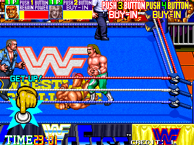
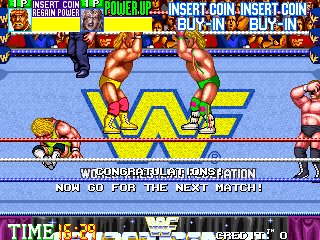

# [Repeated Hit](/README.md#repeated-hit)


### \<List>

- [Repeated Hit (2022.09.08)](#repeated-hit-20220908)


## [Repeated Hit (2022.09.08)](#list)

- Repeat `x` 20 times in **WWF WrestleFest** (Technos, 1991)

  

- Code : RepeatedHit.ahk
    ```ahk
    ^+Space::
        Send, xxxxxxxxxxxxxxxxxxxx
    ```

- Result

    

  It leads a perfect win!
