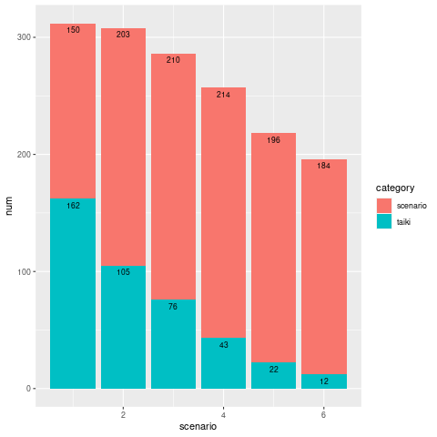

# [RTK2 ERP / R](../../README.md#rtk2-erp)

a great journey to construct RTK2(Romance of The Three Kingdoms II, KOEI, 1989) ERP

## List

0. Load data  
  [0.1 Practice : Load raw data from a scenario (2022.06.24)](#01-practice--load-raw-data-from-a-scenario-20220624)  
  [0.2 Find all the locations of the general data (2022.11.25)](#02-find-all-the-locations-of-the-general-data-20221125)  
  0.3 Load raw data from all scenarios
1. Basic Data Analysis  
  1.x abilities' distribution and so on ……
2. Advanced Data Analysis  
  2.1 K-means clustering
  2.2 PCA
3. Interesting Questions  
  3.1 Predict Where a general belongs to  
  3.2 Who will be the betrayers?


## [0.1 Practice : Load raw data from a scenario (2022.06.24)](#list)

#### `RTK2_General_Analysis_0.R`

  <details>
    <summary>1) Read binary data</summary>

  ```R
  setwd("{Working Directory}")

  path = "SCENARIO.DAT"
  read.filename <- file(path, "rb")
  bindata <- readBin(read.filename, raw(), n = 79385)
  head(bindata)                                               # ok
  ```
  ```
  [1] 00 00 bc 00 0b 0f
  ```
  </details>

  <details>
    <summary>2) Read a general's data in S5</summary>

  ```R
  # S5 data = 52946 ~ 61373 (43 term per 1 general)
  start = 52946 + 1
  end = 61373 + 1
  interval = 43
  bindata[start:(start + interval - 1)]                       # Cao Cao
  as.integer(bindata[start:(start + interval - 1)])           # hex → dec
  ```
  ```
  [1] 6c 0a 00 00 5f 5b 5f 3c 41 63 00 00 01 ff 00 01 01 00 10 27 e8 03 0a 00 00 9b 67 00 43 61 6f 20 43 61 6f 00 00 00 00 00 00 00 00

  [1] 108  10   0   0  95  91  95  60  65  99   0   0   1 255   0   1   1   0  16  39 232   3  10   0   0 155 103   0  67  97 111  32  67  97 111   0   0   0   0   0   0   0   0
  ```
  </details>

  <details open="">
    <summary>3) Read all generals' data in S5</summary>

  ```R
  s5bin <- matrix(bindata[start:end], ncol = 43, byrow = TRUE)
  head(s5bin)                                                 # ok
  ```
  ```
       [,1] [,2] [,3] [,4] [,5] [,6] [,7] [,8] [,9] [,10] [,11] [,12] [,13] [,14] [,15] [,16] [,17] [,18] [,19] [,20] [,21] [,22] [,23] [,24] [,25] [,26] [,27] [,28] [,29] [,30] [,31] [,32] [,33] [,34] [,35] [,36] [,37] [,38] [,39] [,40] [,41] [,42] [,43]
  [1,]   6c   0a   00   00   5f   5b   5f   3c   41    63    00    00    01    ff    00    01    01    00    10    27    e8    03    0a    00    00    9b    67    00    43    61    6f    20    43    61    6f    00    00    00    00    00    00    00    00
  [2,]   10   07   00   00   55   46   63   64   64    55    01    00    01    ff    00    32    02    00    10    27    e8    03    0a    00    00    a1    a1    00    4c    69    75    20    42    65    69    00    00    00    00    00    00    00    00
  [3,]   6a   09   00   00   59   57   62   62   4b    5f    02    00    01    ff    00    64    04    00    10    27    d0    07    14    00    00    b6    6c    00    53    75    6e    20    51    75    61    6e    00    00    00    00    00    00    00
  ……
  ```
  </details>

  <details>
    <summary>4) Read all generals' names in S5</summary>

  ```R
  s5name <- c()
  s5len = as.integer(end - start + 1) / interval              # 196
  for (i in 1:s5len) {
      s5name <- c(s5name, rawToChar(s5bin[i,29:43]))
  }
  s5name                                                      # Ok : Cao Cao ~ Chen Tai (196)
  ```
  ```
    [1] "Cao Cao"      "Liu Bei"      "Sun Quan"     "Meng Huo"     "Xin Pi"       "Cao Chun"     "Fu Gan"       "Jia Xu"       "Cheng Yu"     "Xiahou Dun"  
   [11] "Zhong Yao"    "Xu Zhu"       "Cao Ren"      "Cao Zhen"     "Zhang Lu"     "Hou Xuan"     "Hu Xin"       "Li Tong"      "Zhang Liao"   "Mi Zhu"      
   [21] "Xu Sheng"     "Yu Fan"       "Zhu Huan"     "Gan Ning"     "Zhou Fang"    "Zhou Tai"     "Lu Meng"      "Xiahou Yuan"  "Cao Hong"     "Zhao Yue"    
   [31] "Zhang Fei"    "Guan Yu"      "Ma Chao"      "Wang Kang"    "Cheng Bing"   "Zhang Xiu"    "Han Ze"       "Ling Tong"    "Yang Kai"     "Guan Ping"   
  ……
  [191] "Liu Pan"      "Lei Bu"       "Ling Bao"     "Wen Qin"      "Sun Li"       "Chen Tai"  
  ```

  </details>


  ## [0.2 Find all the locations of the general data (2022.11.25)](#list)

  - Declare a dataframe that contains the general data's locations

  
#### `RTK2_General_Analysis_0.R`

  <details>
    <summary>1) Find all the scenario' general data locations</summary>

  ```R
  # s1 : 22 ~ 6471 (start from 0)
  # s2 : 13253 ~ 21981
  # s3 : 26484 ~ 35513
  # s4 : 39715 ~ 48916
  # s5 : 52946 ~ 61373
  # s6 : 66177 ~ 74088
  ```
  </details>
  <details>
    <summary>2) Declare a dataframe for all scenarios' general data location</summary>

  ```R
  s_start = c(22, 13253, 26484, 39715, 52946, 66177)
  s_end   = c(6471, 21981, 35513, 48916, 61373, 74088)
  t_start = c(6, 7458, 12288, 15784, 17762, 18774)
  t_end   = c(7457, 12287, 15783, 17761, 18773, 19325)
  s_num   = c(s_end - s_start + 1) / 43
  t_num   = c(t_end - t_start + 1) / 46
  ```
  ```R
  sDataLocation <- data.frame(
      scenario = rep(1:6, each = 2),
      category = rep(c("scenario", "taiki"), 6),
      start    = c(matrix(rbind(s_start, t_start), nrow = 1)),
      end      = c(matrix(rbind(s_end, t_end), nrow = 1)),
      num      = c(matrix(rbind(s_num, t_num), nrow = 1))
  )
  sDataLocation
  ```
  ```
     scenario category start   end num
  1         1 scenario    22  6471 150
  2         1    taiki     6  7457 162
  3         2 scenario 13253 21981 203
  4         2    taiki  7458 12287 105
  5         3 scenario 26484 35513 210
  6         3    taiki 12288 15783  76
  7         4 scenario 39715 48916 214
  8         4    taiki 15784 17761  43
  9         5 scenario 52946 61373 196
  10        5    taiki 17762 18773  22
  11        6 scenario 66177 74088 184
  12        6    taiki 18774 19325  12
  ```
  ```R
  sDataLocation[sDataLocation$category=="scenario",]
  ```
  ```
     scenario category start   end num
  1         1 scenario    22  6471 150
  3         2 scenario 13253 21981 203
  5         3 scenario 26484 35513 210
  7         4 scenario 39715 48916 214
  9         5 scenario 52946 61373 196
  11        6 scenario 66177 74088 184
  ```
  </details>
  <details>
    <summary>3) Draw a stacked barplot with label</summary>

  ```R
  ggplot(sDataLocation, aes(x = scenario, y = num, fill = category, label = num)) +
      geom_bar(stat = "identity") +
      geom_text(aes(label = num), size = 3, hjust = 0.5, vjust = 3, position ="stack") 
  # The ggplot2 library doesn't work on my local desktop.
  # Alternative : Run on https://rdrr.io/snippets/

  # Hmm …… it seems to need to find how to join the whole data from SCENARIO.DAT and TAIKI.DAT
  ```
  </details>

  