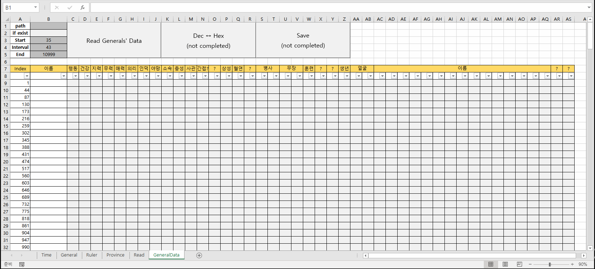

# RTK2 ERP

a great journey to construct RTK2(Romance of The Three Kingdoms II, KOEI, 1989) ERP

- [VBA / General (2021.08.24)](/RTK2#vba--general-20210824)
- [General - Taiki 2 (2021.03.18)](/RTK2#general---taiki-2-20210318)
- [General - Taiki (2020.03.01)](/RTK2#general---taiki-20200301)
- [Province - Pandas (2019.08.12)](/RTK2#province---pandas-20190812)
- [Province (2019.07.23)](/RTK2#province-20190723)
- [Province - Offset (2019.07.22)](/RTK2#province---offset-20190722)


## [VBA / General (2021.08.24)](/RTK2#rtk2-erp)

- read generals' data from a savefile by **VBA**
- generalized structure to depend on parameters that user entered  
  ☞ can **extend** to other data of rulers and provinces, or even common **Hex Editor**



```VBA
Option Explicit


Sub ReadGeneral()

    'Call the target file's path that user entered
    Dim path As String
    path = ThisWorkbook.path & Application.PathSeparator & Range("B1")

    'Check if the file exists
    Dim fileChk As Boolean                              'default : False
    If (Len(Dir(path)) > 0) Then fileChk = True
    Range("B2") = fileChk

    Dim fn As Integer                                   'fn : file number
    fn = FreeFile

    'Read the file
    Open path For Binary Access Read As #fn

        'call parameters that user entered on the sheet
        Dim pos, posEnd, interval As Integer
        pos = Range("B3").Value
        interval = Range("B4").Value
        posEnd = Range("B5").Value
        
        'initialize criteria
        Dim row, col, colEnd As Integer
        row = 1
        col = 1
        colEnd = pos + interval

        'set offset location for output
        Dim output As Range
        Set output = Range("B8")

        'declare name variable for gathering byte data
        Dim data As Byte, name As String
        name = ""

        'loop for each row
        While pos <= posEnd
            
            'loop for shifting a cell to the right
            While col <= interval
                Get #fn, pos, data                      'read data one by one
                If col >= 27 Then
                    name = name & Chr(data)             'assemble name from each byte
                output.Offset(row, col).Value = data    'print each byte
                
                pos = pos + 1
                col = col + 1
            Wend

            'print the general's name of the recent row
            output.Offset(row, 0).Value = name
            name = ""

            'set parameters for the next loop
            row = row + 1
            col = 1
            colEnd = colEnd + interval                  'set the end of the next row

        Wend

    Close #fn

End Sub
```


## [General - Taiki 2 (2021.03.18)](/RTK2#rtk2-erp)
- call and print outside generals' data from `TAIKI.DAT`
- use `os` `bytes()`
- not a large size data but still is open to faster enhancement

#### Mainly added/changed part

```python
# 4. Read The Data

readlocation = (0, 2, 1, 28) + tuple(list(range(7, 13))) + (18,)
# print(readlocation)                                                                 # (0, 2, 1, 7, 8, 9, 10, 11, 12, 18)

print("이름", "출현연도", "출현지역", "혈연", "출생연도", "지력", "무력", "매력", "의리", "인덕", "야망", "상성")

# for i in list(range(0, 10)) :                                                       # test
for i in list(range(0, len(general_offset_init) - 2)) :                             # The last two rows are empty

    general_data[i][2] += 1                                                         # province# : 0~40 → 1~41

    print(bytes(general_data[i][31:46]).decode('utf-8').ljust(15), " ", end='')     # name : [31:46]
    for j in readlocation :                                                         # other values
        print(str(general_data[i][j]).rjust(3), " ", end='')
    print(" ")                                                                      # line replacement
```

> 이름 출현연도 출현지역 혈연 출생연도 지력 무력 매력 의리 인덕 야망 상성  
> Gan Ning  190   21  255  175   51   92   52   79   56   71   98  
> Wang Zhong  190    9  255  167   34   52   53   60   47   52   10  
> Han Hao  190   21  255  153   25   31   15   16   18   32   25  
> Zhao Yue  190    3  255  156   85   99   92   90   88   70   50  
> Chun Yuqiong  190    6  255  146   65   76   68   66   63   71   45  
> Bao Xin  190    9  255  153   30   42   41   47   36   48   10  
> Gong Zhi  190   20  255  158   46   42   52   59   41   44   70  
> Yuan Pu  190   29  255  163   80   33   42   55   53   57   20  
> Man Chong  190   10  255  170   81   40   92   84   88   63   10  
> Ma Wan  190   14  255  175   23   52   26   13   38   39   20  
> ……


## [General - Taiki (2020.03.01)](/RTK2#rtk2-erp)

- call outside generals' data from `TAIKI.DAT`
- succeed in separating each general's data, but they should convert from `ASCII Code(int)` to `string`
- use `os`

```python
# Each Geneal's Data Length : 46 bytes
# Header Data : 6 bytes
```

#### 1. heck If TAIKI.DAT Exists and get the file's length

```python
import os

path = "C:\Game\KOEI\RTK2\TAIKI.DAT"
```
```python
os.path.isfile(path)
```
> True

```python
filelenth = os.path.getsize(path)
num = int((filelenth - 6) / 46)
```
```python
print(num) # There're 420 General's Data
```
> 420

#### 2. Make Offset Initial Information
1) Generate an Arithmetic Progression : a1 = 7, d = 46
2) make (i. j) list from 1)
```python
len(general_offset_init)
len(general_offset_data)
print(general_offset_init[0:10])
print(general_offset_data[0:2])
```
> 420  
> 420  
> [6, 52, 98, 144, 190, 236, 282, 328, 374, 420]  
> [[6, 7, 8, 9, 10, 11, 12, 13, 14, 15, 16, 17, 18, 19, 20, 21, 22, 23, 24, 25, 26, 27, 28, 29, 30, 31, 32, 33, 34, 35, 36, 37, 38, 39, 40, 41, 42, 43, 44, 45, 46, 47, 48, 49, 50, 51], [52, 53, 54, 55, 56, 57, 58, 59, 60, 61, 62, 63, 64, 65, 66, 67, 68, 69, 70, 71, 72, 73, 74, 75, 76, 77, 78, 79, 80, 81, 82, 83, 84, 85, 86, 87, 88, 89, 90, 91, 92, 93, 94, 95, 96, 97]]

#### 3. Call TAIKI.DAT
```python
with open(path,'rb') as f:
    general_raw_data = f.read()
    general_data = []
    
    for i in list(range(0,num)) :
        general_data_row = []

        for j in list(range(0,distance)) :    
            general_data_row.append(general_raw_data[general_offset_data[i][j]])

        general_data.append(general_data_row)
```
```python
print(general_data[0:3])
```
> [[190, 255, 20, 0, 0, 0, 0, 51, 92, 52, 79, 56, 71, 255, 0, 0, 255, 0, 98, 0, 0, 0, 0, 0, 0, 0, 0, 0, 175, 39, 0, 71, 97, 110, 32, 78, 105, 110, 103, 0, 0, 0, 0, 0, 0, 0], [190, 255, 8, 0, 0, 0, 0, 34, 52, 53, 60, 47, 52, 255, 0, 0, 255, 0, 10, 0, 0, 0, 0, 0, 0, 0, 0, 0, 167, 83, 145, 87, 97, 110, 103, 32, 90, 104, 111, 110, 103, 0, 0, 0, 0, 0], [190, 255, 20, 0, 0, 0, 0, 25, 31, 15, 16, 18, 32, 255, 0, 0, 255, 0, 25, 0, 0, 0, 0, 0, 0, 0, 0, 0, 153, 31, 152, 72, 97, 110, 32, 72, 97, 111, 0, 0, 0, 0, 0, 0, 0, 0]]
```python
chr(general_data[0][0])
# Should Convert The Whole List from ASCII Code(int) to string
```
> '¾'

#### Practice
```python
for i in range(1,10) :
    print(i)
```
> 1  
> 2  
> 3  
> 4  
> 5  
> 6  
> 7  
> 8  
> 9


## [Province - Pandas (2019.08.12)](/RTK2#rtk2-erp)

- upgrade : adopt `Numpy` & `Pandas` and convert to a `class`
- The parameter `lord` of the def `dataload` doesn't work yet.
- The columns aren't named yet, too.

```python
# Class using NumPy & Pandas
import numpy as np
import pandas as pd

class Rtk2 :

    # province_offset_data
    def __init__(self) :
        self.province_offset_init = []
        self.province_offset_data = []

        for i in list(range(0,41)) :
            self.province_offset_init.append(11668 + 35*i)
            self.province_offset_data.append(list(range(self.province_offset_init[i], self.province_offset_init[i]+35)))

    # call the save data on each offset location
    def dataload(self, path, lord) :
        self.path = path
        self.lord = lord

        with open(self.path,'rb') as self.f:
            self.province_law_data = self.f.read()
            self.province_data = []

            for i in list(range(0,41)) :
                self.province_data_row = []

                for j in list(range(0,35)) :    
                    self.province_data_row.append(self.province_law_data[self.province_offset_data[i][j]])
                self.province_data.append(self.province_data_row)

        self.province_data_array = np.array(self.province_data)

        # calculate pop, gold and food
        self.province_pop = []
        self.province_gold = []
        self.province_food = []

        for i in list(range(0,41)) :
            self.province_pop.append((self.province_data_array[i][6] + self.province_data_array[i][7]*(2**8))*100)
            self.province_gold.append(self.province_data_array[i][0] + self.province_data_array[i][1]*(2**8))
            self.province_food.append(self.province_data_array[i][2] + self.province_data_array[i][3]*(2**8) + self.province_data_array[i][4]*(2**16))

        # merge the dataframes
        self.province_gold_array = pd.DataFrame(self.province_gold, columns=['Gold'])
        self.province_food_array = pd.DataFrame(self.province_food, columns=['Food'])
        self.province_pop_array = pd.DataFrame(self.province_pop, columns=['Pop'])

        self.province_data_df = pd.DataFrame(self.province_data)

        return pd.concat([
                self.province_pop_array,
                self.province_gold_array,
                self.province_food_array,
                self.province_data_df.iloc[:, 8],
                self.province_data_df.iloc[:, 14:20]
                ],
                axis=1)
```

```python
rtk2 = Rtk2()

save = rtk2.dataload('path', 15) # the parameter lord('15') doesn't work yet
save.head()
```

> Pop   Gold     Food   8   14   15   16  17  18  19  
> 0  274400   4080     4364   3    9   75    4   4   1  27  
> 1  225900  29450  2700000  15   50  100   92   0   2  62  
> 2  253300  29950  2700000  15  100  100  100  28   4  70  
> 3  198500  30000  2699000  15  100  100  100  79   0  66  
> 4  268000  30000  2700000  15  100  100  100  16   1  48  


## [Province (2019.07.23)](/RTK2#rtk2-erp)

- call each province's data of population, gold, food and so on from a save file

```python
# province_offset_data - from Offset.py (2019.07.22)
province_offset_init = []
province_offset_data = []

for i in list(range(0,41)) :
    province_offset_init.append(11668 + 35*i)
    province_offset_data.append(list(range(province_offset_init[i], province_offset_init[i]+35)))
```

```python
# call the save data on each offset location
with open('Documents/신랑/개발/Python/SAVE','rb') as f:
    province_law_data = f.read()
    province_data = []
    
    for i in list(range(0,41)) :
        province_data_row = [] 
        for j in list(range(0,35)) :    
            province_data_row.append(province_law_data[province_offset_data[i][j]])
        province_data.append(province_data_row)

print(province_data[0:3])
```
> [[182, 0, 8, 1, 0, 0, 240, 9, 3, 255, 128, 48, 255, 255, 7, 79, 4, 4, 1, 34, 8, 1, 55, 0, 6, 0, 0, 196, 45, 217, 0, 0, 0, 0, 0],  
> [20, 10, 172, 74, 4, 0, 20, 9, 3, 255, 128, 50, 255, 2, 56, 100, 52, 0, 2, 64, 221, 0, 67, 0, 5, 0, 0, 150, 46, 11, 26, 12, 5, 0, 0],  
> [48, 117, 96, 54, 42, 0, 61, 9, 15, 255, 0, 0, 255, 255, 100, 99, 100, 33, 4, 55, 174, 0, 73, 0, 4, 1, 0, 0, 0, 182, 4, 0, 0, 0, 0]]

```python
# test : gold
province_gold = []

for i in list(range(0,41)) :
    province_gold.append(province_data[i][0] + province_data[i][1]*256)

print(province_gold)
```
> [182, 2580, 30000, 30000, 30000, 7139, 30000, 1783, 29880, 30000, 29988, 30000, 130, 73, 51, 339, 30000, 0, 30000, 11841, 311, 2542, 12033, 0, 100, 100, 100, 605, 3697, 8908, 30000, 22452, 30000, 6341, 7482, 3649, 2528, 574, 4451, 8050, 12206]

```python
# all province data
province_gold = []
province_food = []
province_pop = []
province_rate = []
province_horses = []
province_loy = []
province_land = []
province_flood = []
province_forts = []

for i in list(range(0,41)) :
    province_gold.append(province_data[i][0] + province_data[i][1]*(2**8))
    province_food.append(province_data[i][2] + province_data[i][3]*(2**8) + province_data[i][4]*(2**16))
    province_pop.append((province_data[i][6] + province_data[i][7]*(2**8))*100)
    province_rate.append(province_data[i][19])
    province_horses.append(province_data[i][17])
    province_loy.append(province_data[i][15])
    province_land.append(province_data[i][14])
    province_flood.append(province_data[i][16])
    province_forts.append(province_data[i][18])

print("Province", "Pop\t\t", "Gold\t", "Food\t\t", "Rate Horses Loy Land Flood Forts")
for i in list(range(0,10)) :
    print(i+1, "\t", province_pop[i], "\t", province_gold[i], "\t", province_food[i], "\t", end =' ')
    print(province_rate[i], province_horses[i], province_loy[i], province_land[i], province_flood[i], province_forts[i])
```
> Province Pop             Gold    Food            Rate Horses Loy Land Flood Forts  
> 1        254400          182     264     34 4 79 7 4 1  
> 2        232400          2580    281260          64 0 100 56 52 2  
> 3        236500          30000   2766432         55 33 99 100 100 4  
> 4        179300          30000   1732260         46 82 99 93 96 0  
> 5        246800          30000   2666060         57 19 96 100 100 1  
> 6        499500          7139    233937          50 42 98 79 64 3  
> 7        269800          30000   2730580         37 85 94 100 100 3  
> 8        173600          1783    329476          41 49 100 83 83 2  
> 9        276300          29880   2694902         30 39 95 47 79 2  
> 10       1010800         30000   3000000         33 83 96 100 100 6  


## [Province - Offset (2019.07.22)](/RTK2#rtk2-erp)

- make offset locations' list before call the save data

```python
"""
the initial data offset addresses of the each province (hexadecimal)
1 - 2d94
2 - 2db7   
3 - 2dda
……
41 - 330c
"""
```

```python
# 각 영토별 데이터는 35바이트 단위임을 확인
int('2db7', 16) - int('2d94', 16)
int('2dda', 16) - int('2db7', 16)
```
> 35  
> 35

```python
# 영토별 첫번째 값의 offset 위치를 10진수로 확인
0x2d94
0x330c
type(0x330c) # 이 자체로 int type
```
> 11668  
> 13068  
> int

```python
# 35바이트 간격 리스트 생성하기(*꼭 16진수로 할 필요없다)
province_offset_init = [11668]
for i in list(range(1,41)) :
    province_offset_init.append(province_offset_init[0] + 35*i)

print(province_offset_init)
len(province_offset_init)
```
> [11668, 11703, 11738, 11773, 11808, 11843, 11878, 11913, 11948, 11983, 12018, 12053, 12088, 12123, 12158, 12193, 12228, 12263, 12298, 12333, 12368, 12403, 12438, 12473, 12508, 12543, 12578, 12613, 12648, 12683, 12718, 12753, 12788, 12823, 12858, 12893, 12928, 12963, 12998, 13033, 13068]  
> 41

```python
# offset : gold
province_offset_gold = []
for i in list(range(0,41)) :
    province_offset_gold.append([province_offset_init[i], province_offset_init[i]+1])

print(province_offset_gold)
# offset : food
# offset : loyalty
# an so on …… 
```
> [[11668, 11669], [11703, 11704], [11738, 11739], [11773, 11774], [11808, 11809], [11843, 11844], [11878, 11879], [11913, 11914], [11948, 11949], [11983, 11984], [12018, 12019], [12053, 12054], [12088, 12089], [12123, 12124], [12158, 12159], [12193, 12194], [12228, 12229], [12263, 12264], [12298, 12299], [12333, 12334], [12368, 12369], [12403, 12404], [12438, 12439], [12473, 12474], [12508, 12509], [12543, 12544], [12578, 12579], [12613, 12614], [12648, 12649], [12683, 12684], [12718, 12719], [12753, 12754], [12788, 12789], [12823, 12824], [12858, 12859], [12893, 12894], [12928, 12929], [12963, 12964], [12998, 12999], [13033, 13034], [13068, 13069]]

```python
# province_offset_data (more efficient way)
province_offset_data = []
for i in list(range(0,41)) :
    province_offset_data.append(list(range(province_offset_init[i], province_offset_init[i]+35)))

print(province_offset_data[0:2])
```
> [[11668, 11669, 11670, 11671, 11672, 11673, 11674, 11675, 11676, 11677, 11678, 11679, 11680, 11681, 11682, 11683, 11684, 11685, 11686, 11687, 11688, 11689, 11690, 11691, 11692, 11693, 11694, 11695, 11696, 11697, 11698, 11699, 11700, 11701, 11702], [11703, 11704, 11705, 11706, 11707, 11708, 11709, 11710, 11711, 11712, 11713, 11714, 11715, 11716, 11717, 11718, 11719, 11720, 11721, 11722, 11723, 11724, 11725, 11726, 11727, 11728, 11729, 11730, 11731, 11732, 11733, 11734, 11735, 11736, 11737]]

```python
# province_offset_data (final)
province_offset_init = []
province_offset_data = []
for i in list(range(0,41)) :
    province_offset_init.append(11668 + 35*i)
    province_offset_data.append(list(range(province_offset_init[i], province_offset_init[i]+35)))

print(province_offset_init)
print(province_offset_data[0:2])
```
> [11668, 11703, 11738, 11773, 11808, 11843, 11878, 11913, 11948, 11983, 12018, 12053, 12088, 12123, 12158, 12193, 12228, 12263, 12298, 12333, 12368, 12403, 12438, 12473, 12508, 12543, 12578, 12613, 12648, 12683, 12718, 12753, 12788, 12823, 12858, 12893, 12928, 12963, 12998, 13033, 13068]  
> [[11668, 11669, 11670, 11671, 11672, 11673, 11674, 11675, 11676, 11677, 11678, 11679, 11680, 11681, 11682, 11683, 11684, 11685, 11686, 11687, 11688, 11689, 11690, 11691, 11692, 11693, 11694, 11695, 11696, 11697, 11698, 11699, 11700, 11701, 11702], [11703, 11704, 11705, 11706, 11707, 11708, 11709, 11710, 11711, 11712, 11713, 11714, 11715, 11716, 11717, 11718, 11719, 11720, 11721, 11722, 11723, 11724, 11725, 11726, 11727, 11728, 11729, 11730, 11731, 11732, 11733, 11734, 11735, 11736, 11737]]