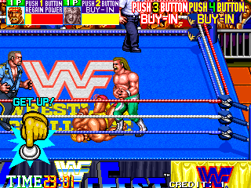
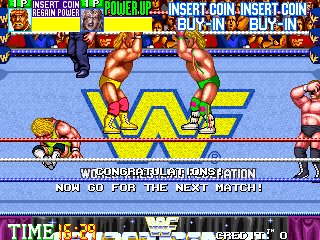

# Repeated Hit


### \<List>

- [Repeated Hit (2022.09.08)](#repeated-hit-20220908)


## [Repeated Hit (2022.09.08)](#list)

- To use in **WWF WrestleFest** (Technos, 1991)



#### `RepeatedHit.ahk`
repeat 'x' 20 times
```ahk
^+Space::
	Send, xxxxxxxxxxxxxxxxxxxx
```

  
It leads a perfect win!