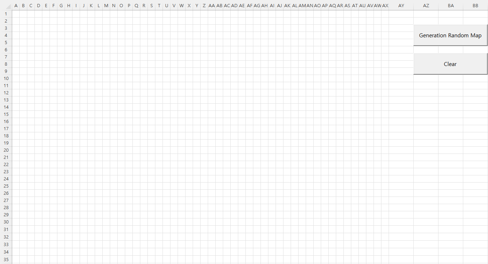

# [Roguelike Game](../README.md#roguelike-game)

Let's make a roguelike game!


## List

1. [Set map size (2022.11.30)](#1-set-map-size-20221130)
2. [Set starting and ending location (2022.11.30)](#2-set-starting-and-ending-location-20221130)
3. Find n ways
4. Build walls
5. Arrange items
6. Arrage monsters
7. Arrage NPCs


## [1. Set map size (2022.11.30)](#list)

  <details>
    <summary>Type.vba</summary>

  - declared in a public module

  ```vba
  Public Type RndMap

      rSize   As Integer
      cSize   As Integer
      Start   As Range
      End     As Range
      Wall()  As Range
      Items() As Range
      Mobs()  As Range

  End Type
  ```
  </details>

  <details>
    <summary>Roguelike.vba</summary>

  ```vba
  Option Explicit
  ```
  ```vba
  ' ★ Manage parameters by user directly
  Private Sub SetSize(ByRef MapData As RndMap)

      MapData.rSize = 30
      MapData.cSize = 50

      With Range("A1").Resize(MapData.rSize, MapData.cSize)
          .HorizontalAlignment = xlCenter
          .VerticalAlignment = xlCenter
          .RowHeight = 15
          .ColumnWidth = 2
      End With

  End Sub
  ```
  ```vba
  Private Sub Main()

      Dim MapData As RndMap

      ' Set map size
      Call SetSize(MapData)

      ……

  End Sub
  ```
  </details>

## [2. Set starting and ending location (2022.11.30)](#list)

  

  <details>
    <summary>Roguelike.vba</summary>

  ```vba
  Private Sub Main()

      Dim MapData As RndMap

      ' Set map size
      Call SetSize(MapData)

      ' Set starting and ending location
      Call SetLocation(MapData)
      ……

  End Sub
  ```
  ```vba
  Private Sub SetLocation(ByRef MapData As RndMap)

      Dim rTemp, cTemp As Integer

      ' Set Starting Cell
      Randomize
      rTemp = Int(Rnd * MapData.rSize)
      cTemp = Int(Rnd * MapData.cSize)
      ' Debug.Print rTemp, cTemp
      Set MapData.Start = Range(Cells(rTemp, cTemp), Cells(rTemp, cTemp))         ' Range(Cells(rTemp, cTemp)) causes an error

      ' Mark Starting Cell
      MapData.Start.Interior.Color = vbBlack
      MapData.Start.Font.Color = vbWhite
      MapData.Start.FormulaR1C1 = "S"

      ' Set Ending Cell
      Randomize
      rTemp = Int(Rnd * MapData.rSize)
      cTemp = Int(Rnd * MapData.cSize)
      Set MapData.End = Range(Cells(rTemp, cTemp), Cells(rTemp, cTemp))

      ' Mark Ending Cell
      MapData.End.Interior.Color = vbRed
      MapData.End.Font.Color = vbWhite
      MapData.End.FormulaR1C1 = "E"

  End Sub
  ```
  ```vba
  Private Sub BtnMapGeneration_Click()

      Call Main

  End Sub
  ```
  ```vba
  ' To-Be : Call MapData
  Private Sub Clear()

      Dim Rng As Range
      Set Rng = Range("A1").Resize(100, 100)

      With Rng
          .ClearContents
          .Interior.ColorIndex = 0
      End With

  End Sub
  ```
  ```vba
  Private Sub BtnClear_Click()

      Call Clear

  End Sub
  ```
  </details>