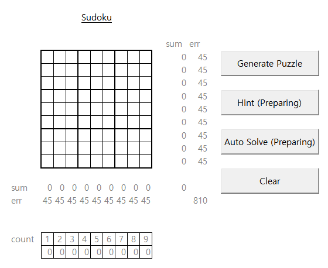

# [Sudoku](../README.md#sudoku)

Let's make a **Sudoku** game in VBA!


## List

0. [Initialization (2022.12.22)](#0-initialization-20221222)
1. [Generate a Sudoku puzzle (2022.12.28)](#1-generate-a-sudoku-puzzle-20221228)
2. [Masking the puzzle by level (2022.12.29)](#2-masking-the-puzzle-by-level-20221229)
3. [Evaluate the Answer (2022.12.30)](#3-evaluate-the-answer-20221230)
4. Hint
5. Auto-solver


## [0. Initialization (2022.12.22)](#list)

  - Base codes are helped by [ChatGPT](https://github.com/kimpro82/MyGame/issues/56#issuecomment-1363135037)
  - Fill the cells just temporarily for test, not for the real game

  

  <details>
    <summary>Codes : Sudoku.bas</summary>

  ```vba
  Option Explicit
  ```
  ```vba
  Private Sub GenerateSudoku()

      ' Set zeroPiont to start 9x9 matrix
      Dim zeroPoint As Range
      Call GetZeroPoint(zeroPoint)

      Dim sudoku(1 To 9, 1 To 9) As Integer

      ' Initialize the Sudoku array with zeros
      Dim i As Integer, j As Integer
      For i = 1 To 9
          For j = 1 To 9
              sudoku(i, j) = 0
          Next j
      Next i

      ' Generate the Sudoku puzzle
      Call GeneratePuzzle(sudoku)

      ' Print the Sudoku puzzle to the sheet
      Call PrintPuzzle(sudoku, zeroPoint)

  End Sub
  ```
  ```vba
  Private Sub GetZeroPoint(ByRef zeroPoint As Range)

      Set zeroPoint = Range("C5")

  End Sub
  ```
  ```vba
  Private Sub GeneratePuzzle(ByRef puzzle As Variant)

      ' Temporary; to be advanced
      Dim i As Integer, j As Integer
      For i = 1 To 9
          For j = 1 To 9
              puzzle(i, j) = Int(Rnd * 9) + 1
          Next j
      Next i

  End Sub
  ```
  ```vba
  Private Sub PrintPuzzle(ByRef puzzle As Variant, ByRef zeroPoint As Range)

      ' Print the puzzle to the sheet
      Dim i As Integer, j As Integer
      For i = 1 To 9
          For j = 1 To 9
              zeroPoint.Offset(i - 1, j - 1).Value = puzzle(i, j)
          Next j
      Next i

  End Sub
  ```
  ```vba
  Private Sub Hint()

      Debug.Print "Hint function is not completed yet"
      ' Debug.Print Me.Name & "() is not completed yet"                           ' Me.Name : "Soduku"

  End Sub
  ```
  ```vba
  Private Sub AutoSolve()

      Debug.Print "Auto Solve function is not completed yet"

  End Sub
  ```
  ```vba
  Private Sub Clear()

      Dim zeroPoint As Range
      Call GetZeroPoint(zeroPoint)

      Dim Rng As Range
      Set Rng = zeroPoint.Resize(9, 9)

      With Rng
          .ClearContents
      End With

  End Sub
  ```
  ```vba
  ' Buttons

  Private Sub btnGenerate_Click()

      Call GenerateSudoku

  End Sub


  Private Sub btnHint_Click()

      Call Hint

  End Sub


  Private Sub btnAutoSolve_Click()

      Call AutoSolve

  End Sub


  Private Sub btnClear_Click()

      Call Clear

  End Sub
  ```
  </details>


## [1. Generate a Sudoku puzzle (2022.12.28)](#list)

  - Generate a Sudoku puzzle with shuffle

  

  <details>
    <summary>Updates : Sudoku.bas</summary>

  ```vba
  Private Sub GenerateSudoku()

      ' Set zeroPiont to start 9x9 matrix
      Dim zeroPoint As Range
      Call GetZeroPoint(zeroPoint)

      ' Initialize the Sudoku array before shuffle
      Dim sudoku(1 To 9, 1 To 9) As Integer
      Call GenerateInitialPuzzle(sudoku)

      ' Shuffle the puzzle
      Call ShufflePuzzle(sudoku)

      ' Print the Sudoku puzzle to the sheet
      Call PrintPuzzle(sudoku, zeroPoint)

  End Sub
  ```
  ```vba
  Private Sub GenerateInitialPuzzle(ByRef puzzle As Variant)

      ' Update (2022.12.28); it seems not minimized but anyway works
      Dim i As Integer, j As Integer, starting As Integer
      For i = 1 To 9
          If i < 4 Then
              starting = (i - 1) * 3 Mod 9
          ElseIf i < 7 Then
              starting = ((i - 1) * 3 + 1) Mod 9
          Else
              starting = ((i - 1) * 3 + 2) Mod 9
          End If

          For j = 1 To 9
              puzzle(i, j) = (starting + j - 1) Mod 9 + 1
          Next j
      Next i

  End Sub
  ```
  ```vba
  Private Sub ShufflePuzzle(ByRef puzzle As Variant)

      Dim n As Integer
      n = 100

      Dim i As Integer, j As Integer
      Dim a As Integer, b As Integer, temp(1 To 9) As Integer
      For i = 1 To n
          a = Int(Rnd * 9) + 1
          b = Int((a - 1) / 3) * 3 + Int(Rnd * 3) + 1                             ' quite proud code …… !

          For j = 1 To 9
              If i Mod 2 = 0 Then
                  temp(j) = puzzle(a, j)
                  puzzle(a, j) = puzzle(b, j)
                  puzzle(b, j) = temp(j)
              Else
                  temp(j) = puzzle(j, a)
                  puzzle(j, a) = puzzle(j, b)
                  puzzle(j, b) = temp(j)
              End If
          Next j
      Next i

  End Sub
  ```
  </details>


## [2. Masking the puzzle by level (2022.12.29)](#list)

  - Masking the puzzle by level between 1 and 9

  

  <details>
    <summary>Updates : Sudoku.bas</summary>

  ```vba
  Private Sub GenerateSudoku()

      ' Set parameters
      Dim zeroPoint As Range, level As Integer, hintNum As Integer
      Call GetZeroPoint(zeroPoint)                                                ' Set zeroPiont to start 9x9 matrix
      Call GetLevel(level)                                                        ' Set level to determine how much masking
      Call GetHintNum(hintNum)                                                    ' Set the number how much hints are given

      ' Initialize the Sudoku array before shuffle
      Dim sudoku(1 To 9, 1 To 9) As Integer
      Call GenerateInitialPuzzle(sudoku)

      ' Shuffle the puzzle
      Call ShufflePuzzle(sudoku)

      ' Masking the puzzle by the level
      Dim sudokuMask(1 To 9, 1 To 9) As Integer
      Call MaskingPuzzle(sudoku, sudokuMask, level)

      ' Print the Sudoku puzzle to the sheet
      Call PrintPuzzle(sudokuMask, zeroPoint)

  End Sub
  ```
  ```vba
  Private Sub GetLevel(ByRef level As Integer)

      level = Range("R2")

  End Sub
  ```
  ```vba
  Private Sub GetHintNum(ByRef hintNum As Integer)

      hintNum = Range("V2")

  End Sub
  ```
  ```vba
  Private Sub MaskingPuzzle(ByRef puzzle As Variant, ByRef puzzleMask As Variant, ByRef level As Integer)

      Dim i As Integer, j As Integer
      For i = 1 To 9
          For j = 1 To 9
              If Int(Rnd * 10) >= level Then
                  puzzleMask(i, j) = puzzle(i, j)
              Else
                  puzzleMask(i, j) = 0
              End If
          Next j
      Next i

  End Sub
  ```
  ```vba
  Private Sub PrintPuzzle(ByRef puzzle As Variant, ByRef zeroPoint As Range)

      ' Print the puzzle to the sheet
      Dim i As Integer, j As Integer
      For i = 1 To 9
          For j = 1 To 9
              If puzzle(i, j) <> 0 Then
                  zeroPoint.Offset(i - 1, j - 1).Value = puzzle(i, j)
              Else
                  zeroPoint.Offset(i - 1, j - 1).Value = ""
              End If
          Next j
      Next i

  End Sub
  ```
  </details>


## [3. Evaluate the Answer (2022.12.30)](#list)

  - Evaluate the answer in real time by `Worksheet_Change()`
  - Use `onGameFlag` to control the affections from `Worksheet_Change()`
  - Declare variables out of `Main()` for new procedures not included in `Main()`
  - Shorten codes in `GenerateInitialPuzzle()` and `PrintPuzzle()`

  

  <details>
    <summary>Updates : Sudoku.bas</summary>

  ```vba
  ' Update (2022.12.30) : Move the Declaration locations out of Main()
  Private Sudoku(1 To 9, 1 To 9)      As Integer
  Private sudokuMask(1 To 9, 1 To 9)  As Integer
  Private sudokuAnswer()              As Integer                                  ' The new array should not be fixed

  Private zeroPoint                   As Range                                    ' zeroPiont     : to start 9x9 matrix
  Private level                       As Integer                                  ' level         : determine how much masking
  Private hintNum                     As Integer                                  ' hintNum       : the number how much hints are given
  Private onGameFlag                  As Boolean                                  ' onGameFlag    : do not run intersect() when False
  ```
  ```vba
  ' Update (2022.12.30) : Rename GenerateSudoku() to Main()
  Private Sub Main()

      ' Set parameters
      Call SetParameters(zeroPoint, level, hintNum)

      ' Initialize the Sudoku array before shuffle
      Call GenerateInitialPuzzle(Sudoku)

      ' Shuffle the puzzle
      Call ShufflePuzzle(Sudoku)

      ' Masking the puzzle by the level
      Call MaskingPuzzle(Sudoku, sudokuMask, level)

      ' Evaluate the answer
      sudokuAnswer = sudokuMask
      ' EvaluatePuzzle() runs through Worksheet_Change()

      ' Print the Sudoku puzzle to the sheet
      onGameFlag = False
          Call PrintPuzzle(sudokuAnswer, zeroPoint)
      onGameFlag = True

  End Sub
  ```
  ```vba
  ' Update (2022.12.30) : Merge 3 procedures for each parameter
  Private Sub SetParameters(ByRef zeroPoint As Range, ByRef level As Integer, ByRef hintNum As Integer)

      Set zeroPoint = Range("C5")
      level = Range("R2")
      hintNum = Range("V2")

  End Sub
  ```
  ```vba
  Private Sub GenerateInitialPuzzle(ByRef puzzle As Variant)

      zeroPoint.Offset(-1, 0).Value = ""

      
      Dim i As Integer, j As Integer, starting As Integer
      For i = 1 To 9
          ' Update (2022.12.30) : More compact code
          starting = (i - 1) * 3 Mod 9 + (i - 1) / 3

  '        Old Ver. (2022.12.28) : it seems not minimized but anyway works
  '        If i < 4 Then
  '            starting = (i - 1) * 3 Mod 9
  '        ElseIf i < 7 Then
  '            starting = ((i - 1) * 3 + 1) Mod 9
  '        Else
  '            starting = ((i - 1) * 3 + 2) Mod 9
  '        End If

          For j = 1 To 9
              puzzle(i, j) = (starting + j - 1) Mod 9 + 1
          Next j
      Next i

  End Sub
  ```
  ```vba
  ' Update (2022.12.30) : Update the SudokuAnswer at once
  Private Sub PrintPuzzle(ByRef puzzle As Variant, ByRef zeroPoint As Range)

      ' Print the puzzle to the sheet
      onGameFlag = False
          zeroPoint.Resize(9, 9).Value = puzzle
      onGameFlag = True

  '    ' Old Ver.
  '    Dim i As Integer, j As Integer
  '    For i = 1 To 9
  '        For j = 1 To 9
  '            If puzzle(i, j) <> 0 Then
  '                zeroPoint.Offset(i - 1, j - 1).Value = puzzle(i, j)
  '            Else
  '                zeroPoint.Offset(i - 1, j - 1).Value = ""
  '            End If
  '        Next j
  '    Next i

  End Sub
  ```
  ```vba
  ' Update (2022.12.30)
  Private Sub Clear()

      Dim Rng As Range
      Set Rng = zeroPoint.Resize(9, 9)
      ' Debug.Print Rng.Address                                                   ' ok

      onGameFlag = False
          Rng.ClearContents
          zeroPoint.Offset(-1, 0).Value = ""
      onGameFlag = True

  End Sub
  ```
  ```vba
  ' Update (2022.12.30)
  Private Sub Worksheet_Change(ByVal Target As Range)

      If (onGameFlag = True) And (Not Intersect(zeroPoint.Resize(9, 9), Target) Is Nothing) Then
          ' Debug.Print Target.Address                                            ' ok
          Call EvaluatePuzzle(Target.Address)
          Call PrintPuzzle(sudokuAnswer, zeroPoint)
      End If

  End Sub
  ```
  ```vba
  ' Update (2022.12.30)
  Private Sub EvaluatePuzzle(ByRef ChangedCell As String)

      ' Debug.Print ChangedCell                                                   ' ok
      Dim i As Integer, j As Integer, ans As Integer
      i = Range(ChangedCell).Row - zeroPoint.Row + 1
      j = Range(ChangedCell).Column - zeroPoint.Column + 1
      ans = Range(ChangedCell).Value
      ' Debug.Print i & j & ans                                                   ' ok

      If Sudoku(i, j) = Range(ChangedCell).Value Then
          zeroPoint.Offset(-1, 0).Value = "Correct!"
          sudokuAnswer(i, j) = Range(ChangedCell).Value
      Else
          zeroPoint.Offset(-1, 0).Value = "(" & i & ", " & j & ") is not " & ans & "!"
      End If

  End Sub
  ```

  </details>